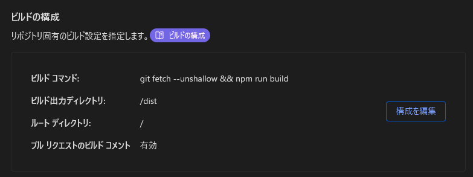

個人サイトあるあるに「更新履歴」なる項目がある。html直書きとか別ファイルに整理したものから生成するとかのバリエーションはあるものの、たいていの場合、これは更新にともない手動で追加されている。しかし、更新時にいちいちチェックリストを読み上げている人はいないだろうし、人間が毎回忘れずに更新履歴を更新してくれるとは期待できない。実際忘れている人を目にすることはしばしばある。であれば、自動化してしまおうというのが今回の趣旨。

## Gitのコミットを取得する

サイトの内容は当然(?)Gitで管理しているので、細かい更新履歴はコミット履歴としてすでに存在している。しかし、さすがに全コミットのメッセージをそのまま表示したのではカオスになってしまう。幸運なことに、普段から主ブランチへのマージはfast-forwordせずにまとめる習慣がついており、また、十分説明として成立するメッセージをつけてあったため、マージコミットのメッセージだけ表示すればいい感じになりそう。~~いにしゃるこみっと~~

Gitのログは`git log`で表示することができ、`--first-parent`をつけることで、ちょうどマージコミットのみを表示することができる。また、`--format`を使うことでほしい情報、今回は日付とコミットメッセージだけを抽出することができる。

```bash
> git log --first-parent --format='%ad %s'
Mon Dec 25 20:48:39 2023 +0900 _更新履歴の変な空白を除去
Mon Dec 25 20:25:43 2023 +0900 _Astroをv4に
Sun Dec 24 21:44:07 2023 +0900 ヘッダーロゴを実装
Sun Dec 24 19:50:57 2023 +0900 _Safariに対応
Fri Dec 22 21:11:46 2023 +0900 Twitter埋込を実装
Fri Dec 22 16:24:11 2023 +0900 OGPのカード表示を実装、ブログに追加
(中略)
Sat Nov 4 22:05:58 2023 +0900 諸修正
Sat Nov 4 18:02:22 2023 +0900 PC周辺機器を加筆
Sat Nov 4 17:25:29 2023 +0900 諸修正
Sat Nov 4 15:01:11 2023 +0900 微修正
Sat Nov 4 12:52:00 2023 +0900 とりあえず見られるようにした
Sat Nov 4 12:51:44 2023 +0900 いにしゃるこみっと

```

Astroはビルド時にNode.jsでJavaScriptを実行して静的なhtmlを生成するわけだが、Node.jsでは`child_process`とかいうやつでローカルのコマンドを実行することができる。つまり、`git log`を実行することができる。このような実行結果(文字列)をオブジェクトとしてJavaScriptに渡すには、~~JSONの形にするのが手っ取り早い~~2項目しかないなら自力でパースしたほうが早い。

```typescript
import { execSync } from "child_process";
const separator = "\uF8FF";
execSync(`git log --format=%ad${separator}%s --date=short --first-parent`)
    .toString()
    .split("\n")
    .map(line => {
        const [date, message] = line.split(separator);
        // ここは後述
    });
```

ここでは`--date=short`として日付部分を`yyyy-MM-dd`で出力してもらい、そのまま文字列として扱っているが、デプロイ環境のタイムゾーンをJSTにしておかないと0000-0900の更新が前日扱いになってしまったりすると思われる。

JSONで処理していたときは文字列を引用符で囲む必要があり面倒だった。Windowsでの`execSync`での既定シェルはコマンドプロンプトだったので、行き当たりばったりで動くように作ったらとんでもなくカオスになった。Cloudflareのデプロイ環境のUbuntuでは当然動かなかった。PowerShellを使えばbashと`'` `"`の挙動は異ならないはずなので同じまま行けると思いきや、PowerShellとは別にWindows側のコマンドライン引数の挙動というのがあるらしくそううまくはいかなかった。シェルに`bash`を明示することで、WindowsでもWSLを使わせるようにして解決していた。

<Tweet id="1723333252092764502" hideThread />


## 整理する

ただメッセージを連ねるのではおもしろくないので、日付ごとにまとめたりしてみる。[Map](https://developer.mozilla.org/ja/docs/Web/JavaScript/Reference/Global_Objects/Map)や[Set](https://developer.mozilla.org/ja/docs/Web/JavaScript/Reference/Global_Objects/Set)なるものを用いて日付とメッセージが重複しないようにしたり、`_`から始まるメッセージは無視したり、コンポーネントの引数で表示日数を指定できるように(トップページで使ってる)したりした。

```typescript
const history = new Map<string, Set<string>>();
let overflow: boolean = false;
// map内
if (!date || !message || message.startsWith("_")) {
    return;
}
if (!history.has(date) && history.size == Astro.props.count) {
    overflow = true;
    return;
}
history.set(date, new Set([...(history.get(date) ?? []), message]));
```

## 描画する

MapだのSetだのは`...`でぶちまけることで`map()`が使える。いつだかのバージョンから改行がビルド時に空白として残ってしまうようになり、変な隙間が空くようになってしまったため、`// prettier-ignore`なるおまじないを唱えてフォーマットしないようにさせている。

```astro
<dl class={Astro.props.inline ? "inline" : ""}>
    {
        // prettier-ignore
        [...history].map(([date, messages]) =>
            <>
                <dt><time datetime={date}>{toJpDateString(date)}</time></dt>
                {[...messages].map(message => (
                    <dd>{message}</dd>
                ))}
            </>
        )
    }
    {
        // prettier-ignore
        overflow && (
            <>
                <dt>それ以前</dt>
                <dd><a href="/changes/">もっと見る</a></dd>
            </>
        )
    }
</dl>
```

<Tweet id="1739214733759357375" />

`toJpDateString(date)`は`yyyy-MM-dd`を`-`で区切ることで`yyyy年MM月dd日`に変換するだけのものである。昔は文字数決め打ちにしていたので`undefined`が渡ると`unde年in月d日`になっていた。

<Tweet id="1723580260854428062" />

## 罠

ローカルでちゃんと動いたのでこのままデプロイしてみると、なぜか最新のメッセージしか表示されなかった。これはCloudflare Pagesではshallow cloneなる機能を用い、最新のコミットのみを取得しているためであるっぽい。解決策としては、ビルド時の処理で`npm run build`の前に`git fetch --unshallow`を追加することで、完全な履歴を取得させることができる。



なお、作ったのが障害発生中だったからか、Cloudflare Pagesのプレビューブランチ参照機能がなぜか`ERR_SSL_VERSION_OR_CIPHER_MISMATCH`とかいうエラーが出て使えないので、本番環境にぶち込んで試してロールバックするなどして動作確認していた。プロジェクトを消して(サブドメインはすぐに解放される)作り直したら特になにも設定することなく使えるようになった。

## 課題

あくまでコミットメッセージを表示しているだけなので、更新されたページへのリンクを張るとかはできていない。これも更新されたファイルを`git diff --name-only`とかして列挙できそうなので、そのへんごにょごにょすればなんとかなるのかもしれない。

## 最終更新も表示する

`git log ファイルパス`で特定のファイルに関するコミットを表示できるのを使えば、同じようにブログ記事に最終更新日時を書ける。こちらではフロントマターの公開日時と合わせるため`Date`オブジェクトにしている。`Date`オブジェクトはタイムゾーンを保持できないため、いちいち9時間足してごにょごにょする`toJpISOString(date)`を作っている。また、公開日と同じ年、月を省略するようにしている。

```typescript
const publish = entry.data.publishDate;
const lastUpdate = (() => {
    const lastUpdateISO = execSync(`git log -1 --format="%ad" --date="iso" ./src/content/${entry.collection}/${entry.id}`).toString();
    return lastUpdateISO.length != 0 ? new Date(lastUpdateISO) : undefined;
})();

const lastUpdateString = (() => {
    if (!lastUpdate || lastUpdate < publish) {
        return undefined;
    }
    const string = toJpDateString(lastUpdate);
    if (publish.getFullYear() != lastUpdate.getFullYear()) {
        return string;
    }
    if (publish.getMonth() != lastUpdate.getMonth()) {
        return string.slice(5, 11);
    }
    if (publish.getDate() != lastUpdate.getDate()) {
        return string.slice(8, 11);
    }
    return undefined;
})();
```

```astro
<time datetime={toJpISODateString(publish)}>{toJpDateString(publish)}</time>
{
    lastUpdateString && (
        <>
            (最終更新: <time datetime={toJpISOString(lastUpdate!)}>{lastUpdateString}</time>)
        </>
    )
}
```

## あとがき

難しいこと考えずにゴリ押しもできるAstroくん最高!!(?)

## 参考

- [Git - git-log Documentation](https://git-scm.com/docs/git-log)
- [Windowsのコマンドライン引数でのクォートの話 #Windows - Qiita](https://qiita.com/igrep/items/d4251d12e85cfc0a00df)
- [Cloudflare Pagesでビルド環境のタイムゾーンを変更 - Pixelog](https://pixelog.net/post/2022/04/04/180306/)