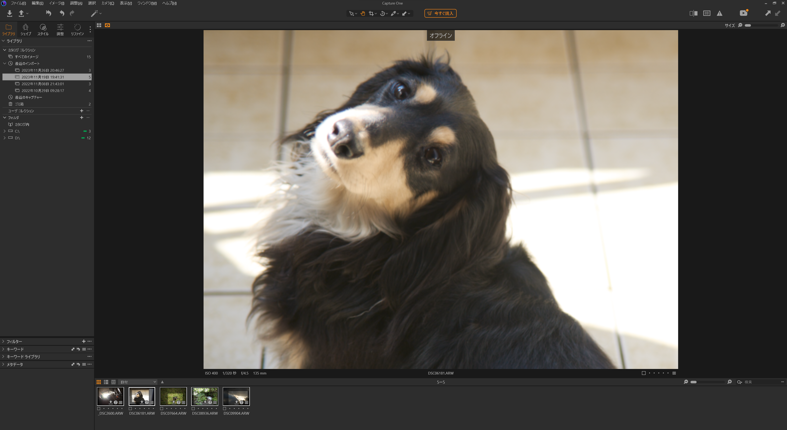
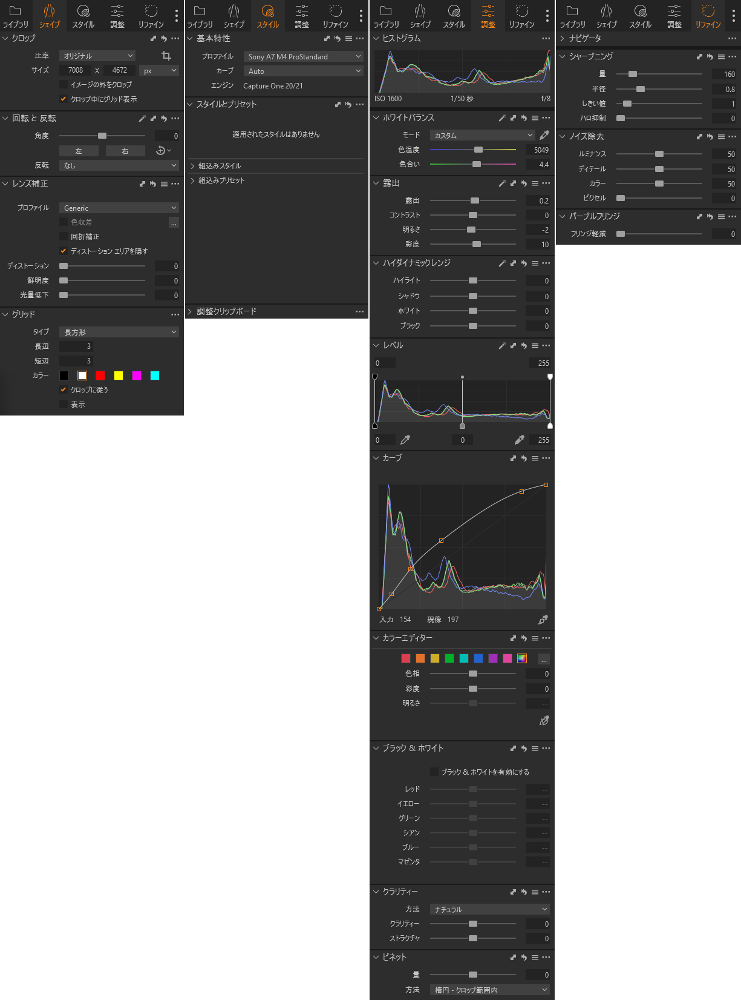
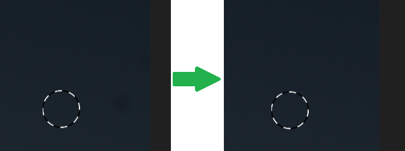
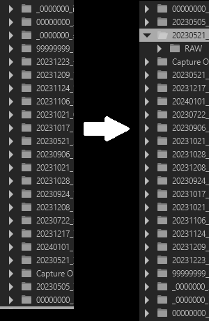
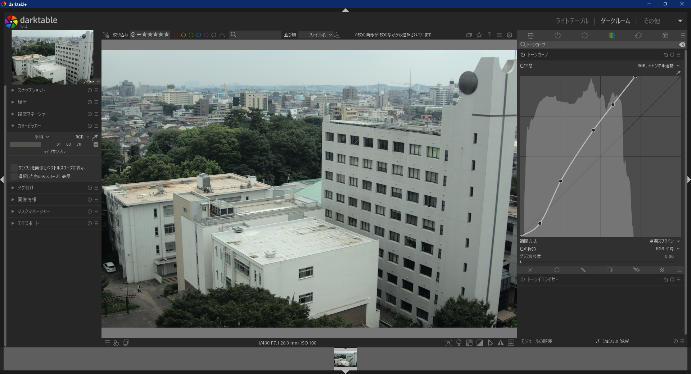
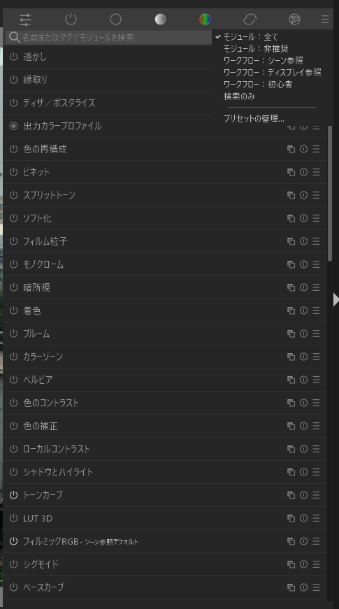
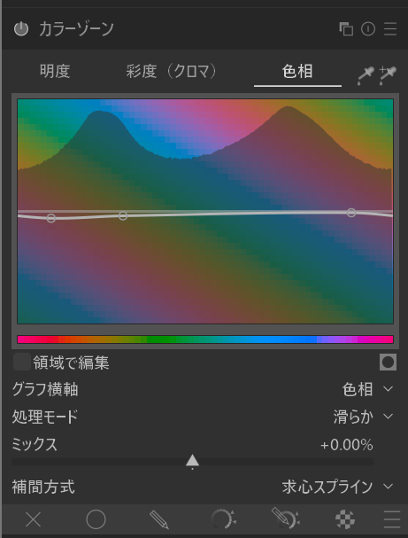
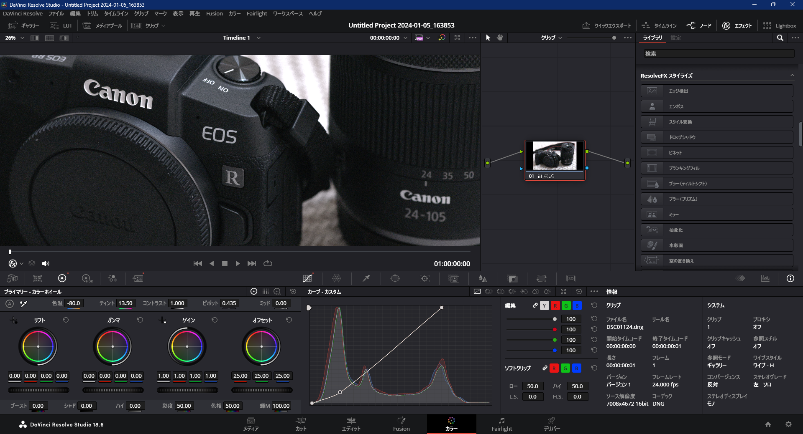

大手(?)RAW現像ソフトCapture Oneには、SONYやFujifilmのRAWのみ扱える無料のExpress版が存在した。しかし、2023年12月、突如「1月いっぱいでおしまい！」との報せが届く。金欠写真趣味人間は、代わりとなる無料のソフトを探すため、GitHubの奥地へと向かった……。

## RAW現像とは?

センサから受け取ったままのデータであるRAWデータをJPEGやHEIFなどの画像データに変換する作業。具体的には、(ベイヤ配列センサの場合)R,G,Bそれぞれ一色ずつの明るさしか持たない画素の集合を、フルカラーの画素の集合に変換する(デモザイク)作業。ついでに、明るさや色を補正したり、ノイズを除去したり、あるいはさまざまな加工をしたりする。RAWデータにはカメラが(撮影の直後にRAW現像して)出力した撮って出しのJPEGなどよりも情報が多く残っているので、JPEGをいじるよりも品質の高い結果を得ることができる。

## 無料ソフト比較

無料で、Windowsで使えて、十分な機能があるRAW現像ソフトして以下のものが見つかった。

- [Microsoft フォト](https://www.microsoft.com/store/productId/9WZDNCRFJBH4)
- [Imaging Edge Desktop (Edit)](https://support.d-imaging.sony.co.jp/app/imagingedge/ja/)
- [RawTherapee](https://github.com/Beep6581/RawTherapee)
- [darktable](https://github.com/darktable-org/darktable)

また、動画編集ソフトの[DaVinci Resolve](https://www.blackmagicdesign.com/jp/products/davinciresolve/)でもRAW現像ができるらしい。

<Tweet id="1732595195357860244" />

以上の無料ソフトおよびCapture Oneを、安定性、操作性、機能などの面から比較してみる。

### Capture One Express (for SONY)

先に紹介した通り、有料ソフトCapture Oneから若干機能が削られ、SONYのRAWのみ扱える無料バージョン。

さすが本来は有料のソフトだけあって、安定性や動作速度に全く不満はない。ハードウェアアクセラレーションにも対応している。

UIはシンプルで、横(デフォルトは右側。昔のバージョンでは左だった)に調整項目、下側に取り込んだファイルの一覧があるだけ。フォントレンダリングがちょっとだけ怪しいがまあ許容範囲内。HiDPI対応にも問題はない。

いったん「インポート」して「カタログ」に取り込み、そこから選んで編集する形になっている。実体をカタログのフォルダにコピーすることも元ファイルを参照することもできる。調整項目の一番左側のタブがカタログの一覧となっており、ここで選んだカタログ内のファイルが下に表示される。

これで慣れているというのもあるが、調整できるパラメータは多すぎず少なすぎずちょうどいい。

スライダの数値は直接入力でき(重要)、そこにカーソルのある状態で上下キーや、マウスホイールでの調整(スクロールと設定で変更)もできる。トーンカーブもホイールや方向キーで調整できる。

<Tweet id="1740377146932314127" />

ミノルタレンズでも色収差、回折、パープルフリンジ等のレンズ補正がしっかり効いてくれる。

機能も操作性も優れていて、これが使えなくなってしまうのは惜しい。~~G○○gleみたいな仕草をしてこなければ金に余裕ができたら払う選択肢もあったけど……。~~

### Microsoft フォト

Windows 11標準のフォトビューア。たいていはエクスプローラ等から開くときに使うが、写真管理機能(いらない)もあったりする。ちなみにスタートメニューでの表示名は「フォト」。一般名詞を固有名詞のように使うな。

悪名高きWindows 11で変更が加えられた部分なので不安だが、いまのところ安定性や速度に問題はない。(Win10でもRAW編集はできるはず)

UIは上にタブがあり、トリミング、調整、フィルタ、マークアップ、レタッチ、背景のモードを切り替える。トリミングの操作感は良好。

調整できる項目はごく限られており、ノイズ除去やレンズ補正、トーンカーブの調整はない。あとWin11あるあるで日本語がちょっと怪しい。強調表示ってハイライトのことかよ。レタッチが調整とは別に用意されており、簡単な操作でゴミを取り除くことができる。写真編集の範囲からは逸脱しているが、マークアップではペンで線を引くことができ、「背景」では背景を検出して透過させたりできる。だいたいiOS標準の「写真」と似たような感じ。

スライダは数値入力とマウスホイールでの調整はできないが、方向キーでの調整はできる(そのことを示すポップアップがいちいち出てきてうざい)。

本格的な編集には使えないが、ちょっといいかんじにしてTwitterに投げたいな、くらいのときには便利そう。

### Imaging Edge Desktop (Edit)

SONY純正ソフト。当然SONYのRAWしか扱えない(コニカミノルタもだめ)。インストール方法が謎で、まず「Imaging Edge Desktop」をインストールしたあと、そこから「Remote/Viewer/Edit」をプラグインのようにインストールする形になっている。ほかに何か入れられるものがあるわけではない。あとからランチャーっぽいほうのImaging Edge DesktopをアンインストールしてもEditとかは消えずに使えた。謎。

公式のソフトだけあって安定性に問題はないが、調整の反映が遅いことがあり、効果を見ながら微調整といったやり方が少ししんどい。ハードウェアアクセラレーションに対応しているのかどうかは知らないが、トーンカーブをいじっただけでCPU使用率が100%に張り付く。

<Tweet id="1743921197669335174" />

UIはCapture Oneによく似ているが、調整項目がタブ分けされていないのは地味に気が利かない。ダークモードなのにところどころ白い部分があるのが雑なかんじ。なぜか文字がシステムフォントではなくMS UI Gothic。HiDPIで表示がぼやけるといったことはない。

「Viewer」を用いてファイルの選択をすることができるが、とくに「Edit」と連携しているわけではなく、エクスプローラ等から直接開くこともできる。写真管理の機能は求めておらず編集だけできればいいので、ここが分かれているのはよい、のだが、同時にしかインストール/アンインストールできないのでほぼ無意味。

調整項目は最低限のみで、自由度は高くないが、迷いも少ない。編集画面の表示がいかにも部分ごとに処理していますよという感じにちらつくのが地味にうざい。ノイズ調整の項目は(全体の?)適用量、カラー、エッジしかないが、どういじっても撮って出しや他のソフト並みの効果を得られずよく分からない。レンズ補正はミノルタレンズに対応しておらずグレーアウトしている。

スライダの数値の直接入力はできるが、マウスホイールや方向キーで数値を調整することはできない。数値のないトーンカーブではマウスのD&D以外の調整方法はない。

トーンカーブをいじるとヒストグラムがそれに応じて変形し、カーブの横軸とヒストグラムの横軸が一致しない状態になる。非常に使いにくい。

<Tweet id="1743795505682157823" />

多少遅いのは我慢するとしても、ノイズやレンズの補正が足りないし、一番よく使うトーンカーブ部分の挙動がキモいので論外。

### RawTherapee

Windows、Linux、macOSに対応したオープンソースの無料ソフト。編集時のバージョンは5.9。だいたいのカメラに対応してるらしい。`winget`から入れることができる。

安定性については自分の環境では論外で、パラメータを触ると100%落ちるので評価のしようがなかった。昔親に紹介されて一瞬触った記憶があるが、そのときもここまでではないが落ちてた気がしてきた。α7 IVなのがダメなのかなと思ったけどα77のでも落ちた。JPEGでも落ちた。v4.2を試しても変わらず、v3.0なら動いたがα77ですら非対応だしUIが現行とだいぶ違うしで見なかったことにした。

UIはファイルブラウザと編集画面とに分かれている。編集画面は左にヒストグラムや編集履歴、右に調整項目、上にファイラで開いていたフォルダのファイル一覧。ファイルブラウザは左にツリー、右にフィルタのいろいろである。文字はデフォルトでは変なフォントになっているが、レンダリングはちゃんとしていて、Yu Gothic UIを指定してやれば通常のWindowsアプリと見分けのつかない表示になる。疑似HiDPIモードなる設定があるが、有効でも無効でもちゃんと表示されたのでよくわからない(Windowsが気を利かせてる?)。

ファイルはファイルブラウザから1枚づつ開くようになっている(設定で同時に複数枚開けるようにもできそう)。ファイルブラウザはぱっと見は使いやすそうなのだが、左側の階層表示のほうではフォルダが謎の順番で表示されており、展開するたびに違うところに吹っ飛んでいくなど実用に耐えない。エクスプローラ等から直接開くこともできるので使わなければいい話ではある。編集内容はRAWファイルと同じフォルダに`.pp3`ファイルとして保存され、フォルダが散らかる。

画像を選ばない状態で虚無を調整すれば落ちないので操作感の確認だけしてみると、スライダは数値入力と方向キーでの調整はできるが、マウスホイールではできなさそう。トーンカーブの点はD&D以外では動かせなさそう。

UIはきれいで、機能も充実していそうではあったが、とりあえず最低限動いてくれないことには始まらない。てかよく見たら最終リリースが2022年だった。

### darktable

Windows、Linux、macOSに対応したオープンソースの無料ソフト。編集時のバージョンは4.6。だいたいのカメラに対応してる。`winget`から入れることができる。

動作は初回起動こそ遅いものの、2回目以降はなぜか速い。調整の反映に待たされるようなこともほぼない。RawTherapeeのように落ちることもない。

UIはRawTherapeeと似ている。ファイル一覧画面の「ライトテーブル」と編集画面の「ダークルーム」がある。編集画面では、上部ではなく下部に取り込んだファイルのうち選択したファイルの一覧がある。ClearTypeのサブピクセルレンダリングを無効にしていると、文字が汚すぎるのが難点。フォントは一括で変更できず、テーマファイルを解読してCSSで上書きしてやらなければいけない。Yu Gothic UIにしてやると多少マシになるがまだ汚い。4Kモニタにしたら画素密度の暴力でギリ読めるようになった。ほかにもデフォルトテーマの色が終わってたり、調整項目の有効と無効の色の差が小さすぎて分かりにくいなど、UIまわりはツッコミどころが多い。

ファイルはCapture Oneのようにいったん「コレクション」に取り込む形になっている。インポートの際、Windowsのファイルを開くダイアログではなく独自のファイラーが出現するが、これのツリーもRawTherapeeのファイルブラウザのように順番がランダムにシャッフルされる。同じライブラリを使っているのだろうか……。取り込み方もCapture Oneと同様に、あらかじめ指定してあるフォルダにコピーするか、元ファイルを参照するかを選ぶことができる。編集内容の保存は、既定では`.xmp`ファイルが生成され散らかされるが、データベース(実体は`%localappdata%`にある)にのみ保存するようにもできる。

調整項目は大量にある。いくつかを選別するプリセットみたいなものがあるが、それでも多すぎてわけが分からない。この手の無料ソフトにありがちな、高すぎる自由度のなかを自力で這いまわる必要があるタイプ。ホワイトバランスについて[複雑な思想](https://docs.darktable.org/usermanual/4.6/en/preferences-settings/processing/)があるらしく、よくわからないのでれがしぃとされているシンプルなモードにしてみたりした。

あまり使わないが、色の補正に関してはCapture Oneのそれ(いつだかのバージョンからちょっとわかりにくくなった……)よりも直感的で使いやすそうなUIだったりもする。

スライダの数値はホバー状態でスクロールかフォーカスのある状態で方向キーで変更できる。さらに、右クリックすると数値の直接入力とマウスでの詳細な調整ができる(カーソルを動かすだけで即時反映され、クリックで確定)のが面白い。トーンカーブは方向キーで微調整でき、上下のみマウスホイールで調整できる。

<Tweet id="1744002788773044234" />

lensfunという有志のデータベースにあるレンズでは歪曲、倍率色収差、周辺減光の自動補正が行えるが、あまり充実しているといえるデータベースではない。それとは別に自動検出っぽい色収差補正があり、Capture Oneほどではないが条件によっては効いてくれる。パープルフリンジの補正については気配がなかった……。

ちょいちょい不満や足りない部分はあるものの、パフォーマンスや操作性もよく、総合的に見ればCapture Oneと渡り合えるのはこいつくらいなので、今後はこれを使っていこうと思う。

### DaVinci Resolve

写真編集ソフトではなく動画編集ソフトだが、どうやら写真編集ができるらしい。キャンペーンで無償提供された~~のにずっと放置していた~~有料版を使ったが、無償版でもたぶんできる。

安定性は、FHDとか4Kとかに縮小して扱う分には問題なさそうだが、α7 IVの33MPそのままで読み込んだせいか、めちゃくちゃRAMを食って落ちることがあった。ちなみに、プロジェクトの保存みたいなことはしていなかったが、初期設定でバックアップが取られており、続きからやり直すことができた。起動はなかなか時間がかかるが、調整の反映速度などは問題なかった。

UIは動画の世界のものというかんじでよくわからない。効果を線でつないだりとかする。プレビューを表示する部分がちっちゃい。ファイルを読み込む方法もよくわからない、素材の一つとして読み込んでいる？

調整は、動画で使うことが想定されているのであろう数々のエフェクトを使うことができる。色収差の補正はレンズに関係なく自動で検知しやってくれる。

調整のスライダは数値入力でき、スライダをクリックした後ならマウスホイールでも動かせる。方向キーでは変更できない。トーンカーブはD&D以外では調整できない。

これまで慣れていたものとはかけ離れたものだし、本来の用途ではなく、わざわざ写真編集のためだけに使うものではないなぁといったかんじ。

## まとめ

Capture Oneに見放されたSONY, Fujifilmユーザや、純正ソフトに満足できないその他の人で、Phase OneやAdobeに金を払う気がないという人は、darktableを使うのが無難かもしれない。公式ドキュメントが充実しており、GitHubのstar数などを見る限りユーザ数も多そうで、開発も活発である。機能が多すぎることだけ慣れが必要そう。