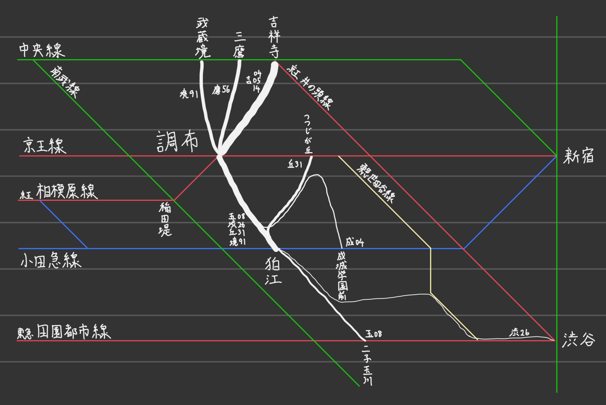

※この記事の内容はダイヤ改正等で古くなる可能性があります。最新の情報は各社公式サイトを参照してください。

電気通信大学の最寄、調布駅には京王線以外の鉄道は通っておらず、京王線が止まると陸の孤島となってしまうように見える。そのくせ京王線はほぼ高架化されておらず踏切が存在したり、複々線化されていなかったりと時代遅れの鉄道のため、すぐに事故るし遅延の回復も遅いし千歳烏山に特急が止まるしそもそも普段からまともに動いていない。

しかし、公共交通機関は鉄道だけではない。調布は小田急バスの元本拠地であり、調布駅は各所から路線バスが集結する地である。これを使えばどこからでも調布に出入りするくことができる。(24年度共通テスト地理Bで、選択肢の都市のうち、西鉄バスに支配された福岡市に次ぎバスの利用率が高いのが調布市だったのは記憶に新しい)

## 振替輸送

迂回する際は、振替輸送を使うとよい。輸送障害時、指定された路線に追加料金なしで乗車することができる制度である。かなり広い範囲が指定され、周辺の路線はほぼ対象となる。明記されないがバスも利用することができ(業務無線で通知されているのをたまに耳にする)、京王線なしで調布に行くにはほぼ必須である。バスを利用する際には当該路線の会社の駅で振替乗車票をもらう必要がある。~~ことになっているがだいたいなくても乗せてもらえる。~~ 

注意点として、定期券やその他きっぷなど区間が決まっている乗車券のみが対象で、定期でないICカードは対象外である。

<OGPCard url="https://www.keio.co.jp/train/other/transfer_transportation/index.html" />

以下では周辺の京王以外の鉄道駅と調布駅とを結ぶルートを紹介する。鉄道駅までの経路は路線図で確認しよう。iOSの場合は純正「マップ」の「交通機関」表示がとても見やすいのでおすすめ。Googleマップ? 捨てろ。[Yahoo!マップ](https://map.yahoo.co.jp/?lat=35.65189&lon=139.54440&zoom=12&maptype=trainRoutes)ならまだマシかも。

## 武蔵境・三鷹・吉祥寺からバス

中央線沿線からは以下のバスが使える。

- 境91 武蔵境駅南口⇄調布駅北口(⇄狛江駅北口)
- 鷹51、鷹56、鷹61、鷹66 三鷹駅(南口)⇄調布駅北口
- 吉05、吉06、吉14 吉祥寺駅(南口)⇄調布駅北口

いずれも実用的な本数がある。吉祥寺の乗り場は駅から微妙に遠くてばらけているうえ、歩道は無駄に混んでるので移動時間も考慮すること。

## 狛江・成城学園前からバス

小田急線沿線からは以下のバスが使える。

- 玉08、渋26、丘31、番号なし 狛江駅北口⇄調布駅南口
- 境91 狛江駅北口⇄調布駅北口

実用的な本数がある。振替輸送需要が殺到すると[遅延する](https://twitter.com/DG_7D/status/1953410415964156247/photo/1)が、少し待てば来るはずである。数系統出ているが、狛江駅では調布行きはすべて同じ乗り場から出るので来たやつに乗ればよい。小田急狛江駅には各停と準急しか止まらない点に注意。また、調布駅から使う場合は狛江営業所止まりがあること、**境**91と**武**91が同じ乗り場から出ることに注意。

- 成04 成城学園前駅西口→調布駅南口

あまり本数が多くないうえ、遠回りで時間がかかるが、京王線が止まっても混まないという利点はある。

## 稲田堤から相模原線

京王本線が壊れていても相模原線(調布から南方向に生えてる奴)は動いていることがある。ただ、動いている扱いになっていてもほぼ来なかったりすることが多いのと、稲田堤までは南武線を使うはめになるのでおすすめはしない。

## 二子玉川からバス

- 玉08 二子玉川駅⇄狛江駅⇄調布駅南口

ちょっとひかえめな本数だが、南武線に乗らずに済む。

## 矢野口から徒歩

南武線矢野口駅から調布駅は40分くらいで歩ける。

## その他

実用性は怪しいが一応存在するルートを挙げておく。

### つつじヶ丘からバス

調布付近でやらかされた場合、新宿～つつじヶ丘は動いてることがある。そんなときは丘31 つつじヶ丘駅南口→調布駅南口が使える。遠回りで時間がかかるので、素直に電車で狛江まで行ったほうがたぶん速い。

### 渋谷からバス

一日2本だけ、渋26 渋谷駅⇄調布駅南口なるバスが存在する。もしかしたら時間が合うかもしれない。暇でしかたないときは乗ってみよう。

### ほか

[Wikipedia](https://ja.wikipedia.org/wiki/%E8%AA%BF%E5%B8%83%E9%A7%85#%E3%83%90%E3%82%B9%E8%B7%AF%E7%B7%9A)に無駄に細かくバス路線が列挙されている。

## あとがき

いざ止まったときに慌てないよう、京王線以外も含め、事前に迂回路を確認しておくことをおすすめする。バス乗り場の位置なども把握しておこう。ちなみに、ここで紹介したバスはすべて前乗り先払いである。乗車時に(支払いをせず)運転手に振替輸送を利用することを伝えよう。

また、毎日京王線に乗る生活はなかなかストレスフルであるので、吉祥寺や狛江を経由しても遠回りにならないのであれば、最初からバスを通学経路とすることをおすすめする。小田急バスの定期は年度定期がお得。