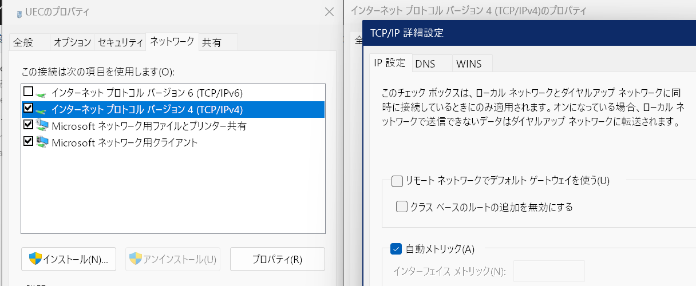
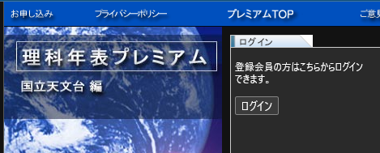

新入生のやってくる季節ということで、電通大のVPN接続に関する設定を共有しておく。

VPNとは、その名の通り仮想的にLANケーブルを大学から家まで引っ張ってくるようなもの。自宅を電通大の飛び地にできる。VPN接続をすると「身内」という扱いになり、セキュリティが緩められた状態で使うことができる。たとえば、統合認証の2要素認証がスキップされたり、Sambaサーバに接続できたりする。前者はポータルやWebClassを使うとき、後者はコンリテや基礎プロの課題をやるときとかに便利。また、「理科年表プレミアム」など、大学からのアクセスでのみ使用できるサービスを自宅から使用することもできる。

通常の方法ではすべての通信が一旦大学まで転送され、学外へも大学の回線からアクセスするようになる。この方法では、学外への通信が遅くなったり、~~貧弱な~~大学の設備に過剰な負荷をかけることになる。このままマイニングなんかすると[怒られが発生](https://qiita.com/Shunk_/items/85b4e5ae77e321490b5f)するかもしれない。

そこで、学内への通信にのみVPNを使用し、学外への通信は無効のときと同様直接行われるようにしてみた。

## 設定(Windows)

### 通常の接続設定

まずは[情報基盤センタの案内](https://www.cc.uec.ac.jp/ug/ja/remote/vpn/l2tp/index.html)に従って普通にVPNの設定をする。ここでは接続名を`UEC`とした。

### ルーティング設定

この状態ではすべての通信をVPN経由で行うようになっているのを解除する。Win+Rなどで「ファイル名を指定して実行」を開き、`ncpa.cpl`と入力して実行、「UEC」を右クリック→「プロパティ」→「ネットワーク」タブへ進む。

まず、「インターネットプロトコルバージョン6 (TCP/IPv6)」の左側のチェックを外す。これでIPv6がVPNについて無効になる。

次に、「インターネットプロトコルバージョン4 (TCP/IPv4)」が選択された状態で右下の「プロパティ」を開き、右下の「詳細設定」→「リモートネットワークでデフォルトゲートウェイを使う」のチェックを外し、「OK」を3回でネットワーク接続の設定に戻る。これで、IPv4のすべての通信をVPN経由にする設定が解除され、指定した宛先への通信のみVPN経由、それ以外は通常の経路になる。この段階では何も設定していないため、VPNを有効にしても使用されない。



次にPowerShell(コマンドプロンプトではなく)を開き以下のコマンドを入力する。`UEC`の部分は上で設定したVPN接続の名前。これで電通大および理科年表への通信のみVPN経由に設定された。それ以外のサービスに学内回線から接続する必要が生じた場合は、IPアドレスの範囲を調べて(後述)同様に追加すればよい。

```powershell
Add-VpnConnectionRoute 'UEC' -DestinationPrefix 130.153.0.0/16
Add-VpnConnectionRoute 'UEC' -DestinationPrefix 192.50.30.0/23
Add-VpnConnectionRoute 'UEC' -DestinationPrefix 202.255.56.0/22
```

なお、以下のコマンドでVPN接続に設定されているルーティングが確認できる。

```powershell
(Get-VpnConnection 'UEC').routes
```

### ショートカット作成

`rasphone.exe -d "UEC"`とかにショートカットを貼れば叩くだけでVPN接続できる。タスクスケジューラとかでログオン時に実行するようにすれば自動接続することもできる。なお、同時に接続できる端末は一つまでのようなので、家のPCをつけっぱなしでつなぎっぱなしにすると外出先で(そうそう使わないと思うけど)接続できなかったりするので注意。

## 設定(macOS, iOS, iPadOS)

「すべての信号を送信」をオフにするとVPNサーバと同じネットワークだけがVPN経由になるとされているがならない。謎。

## 設定(Android)

実機を所有していないので詳しいことは分からないが、フォワーディングみたいな項目があるらしく、そこに`130.153.0.0/16`を入れればいけるらしい。

## 設定(Linux)

自分で調べてください。

## 接続確認

学内ネットワークに対してVPN経由になっていれば、[ITCポータル](https://www.cc.uec.ac.jp/portal/)で統合認証ログインする際二要素認証を求められず、また、「利用中のネットワーク：学内ネットワーク」と表示される。

学外ネットワークに対しては、[minsoku.net](https://minsoku.net/hostname_confirmations)などでホスト名を確認して`uec.ac.jp`と表示されればVPNと大学経由、`kddi.ne.jp`などそれ以外なら直接アクセス。

また、[理科年表プレミアム](https://www.rikanenpyo.jp/member/?module=Member&action=Login)に対しては、大学経由になっていればボタン一つでログインできるようになる。



## 参考: 電通大関連IPアドレス

[情報基盤センターのプロキシ設定のページ](https://www.cc.uec.ac.jp/ug/ja/network/proxy/index.html)には以下のIPアドレスが学内アドレスとして記載されている。

<dl>
    <dt>130.153.0.0/16</dt>
    <dd>電通大が所有しているグローバルIPアドレス。[WHOIS](https://whois.nic.ad.jp/cgi-bin/whois_gw?key=130.153.0.0)でも確認できる。これをVPN経由にするのが今回の主題。</dd>
    <dt>192.50.30.0/23</dt>
    <dd>なぜか最後の`.0`が抜けて記載されている。これも電通大のグローバルIPアドレス。[WHOIS](https://whois.nic.ad.jp/cgi-bin/whois_gw?key=192.50.30.0)でも確認できる。使っているところは見たことない。192から始まるのでプライベートIPアドレスに一瞬見えるが、プライベートIPアドレスに使えるのは192.168.0.0/16。</dd>
</dl>

また、[プロキシ自動設定スクリプト](http://proxy.uec.ac.jp/proxy.pac)には以下のアドレスが学内(プロキシ経由としない)IPアドレスとして記載されている。

<dl>
    <dt>130.153.0.0/16</dt>
    <dd>同上</dd>
    <dt>172.21.0.0/16</dt>
    <dd>電通大内でのプライベートIPアドレス。UEC WirelessやVPNを繋ぐとこの中から割り当てられる。なお、これが自宅のプライベートIPアドレスと重複していた場合、先の画面にちらっと出てきた`クラスベースのルートの追加を無効にする`がチェックされていると自宅、されていないとVPN先が優先されるらしい。そうそうないことではあるが、万が一重複していたらチェックしてみるといいかもしれない。</dd>
</dl>

## 参考: 学外サービスIPアドレス

<dl>
    <dt>202.255.56.0/22</dt>
    <dd>理科年表プレミアムを提供する丸善雄松堂の所有するIPアドレス。[WHOIS](https://whois.nic.ad.jp/cgi-bin/whois_gw?key=202.255.56.00)で確認できる。</dd>
</dl>

ちなみに、これらのIPアドレスの範囲は、まず`nslookup`等でIPアドレスを取得し、それを[管理情報検索サービス](https://www.cman.jp/network/support/ip.html)にぶちこむことで得ることができた。

## あとがき

自分用メモにちょっと手を加えただけの突貫工事なので雑なところはお許しください。よい大学生活を！　あ、あと[写真研究部](http://www.uecphoto.club.uec.ac.jp/)をよろしくお願いいたします！