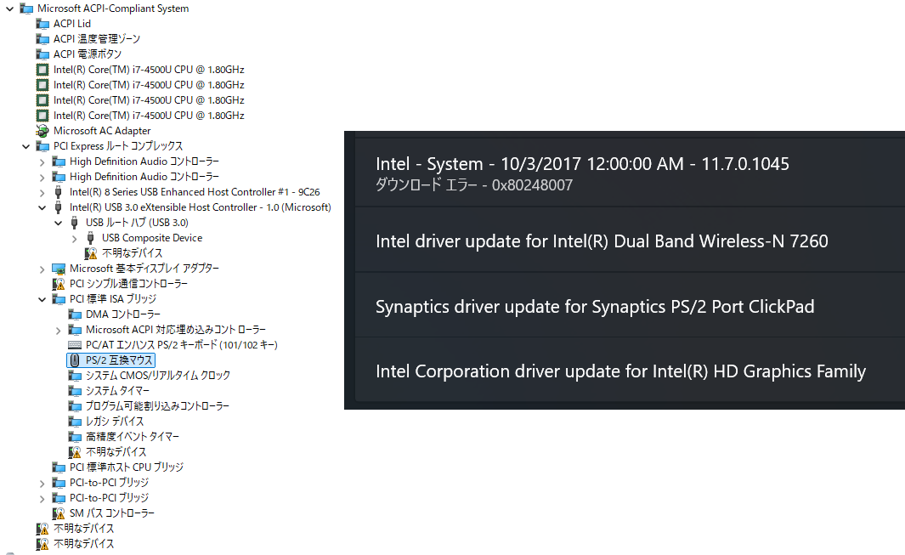
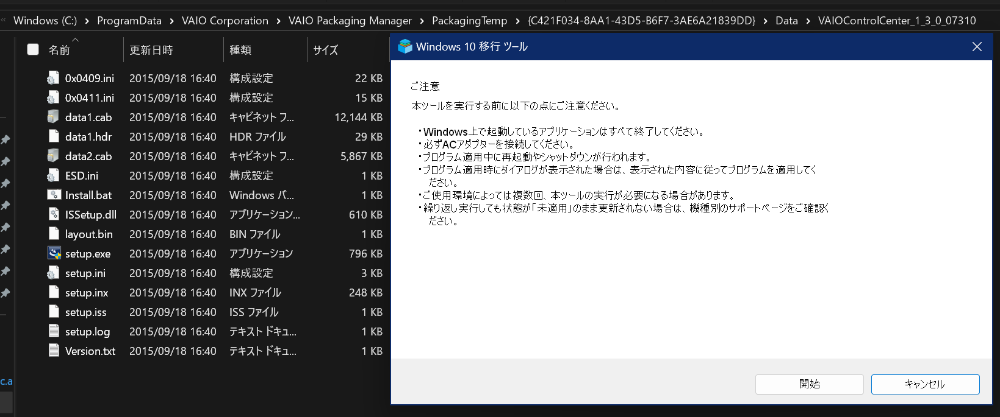

しばらく前にBIOSを破壊して無理矢理焼きなおした結果機種情報が吹き飛び、専用ソフト類がインストールできない可能性があるためクリーンインストールを渋っていたSONY VAIO Pro 13 (SVP132)があった。しばらくWoLの踏み台の常時起動PCとして稼働していたが、N100搭載PCの導入により退役し、気兼ねなく破壊できるようになったのでBIOSの修復を試みたところ成功した(いつか別の記事に書くかも)。懸念点が解消されたので、満を持してWindows 11 (24H2)をクリーンインストールした。公式のアップデートの提供すら終了した「VAIOの設定」まで使えるようにするためいろいろと試してみたので、ひととおり手順を記す。

## ドライバを抽出、リカバリメディア作成

一部入手が難しいドライバがあるので、動作環境があるなら破壊する前に`dism`とかDriver Store Explorerとかで抽出して破壊しない場所に置いておく。`C:\Windows\Drivers\EXE\`にもなんか転がってるかもしれないのでバックアップしておく。(ネタバレすると必要なのはSFEP周りだけ。)

専用ソフトウェアも同じく入手が難しいが、これは動作環境から抜き出すのは難しいので、作成可能なら[リカバリメディアを作っておく](https://knowledge.support.sony.jp/electronics/support/articles/S1210050042613)。一旦作ったらUSBメモリとかに入れっぱなしじゃなくて中身をHDDとかに移してもOK(UEFIなのでファイルになってないブートセクタが云々みたいなのはない、たぶん)。

リカバリメディアがなければリカバリメディア送付サービス(生きてるのか?)を使うか、諦めて怪しいサイトから入手するしかない。

## Windows 11を無理矢理インストールする

### Windowsを展開する

SVP132はWindows 11非対応デバイスであり、インストーラからインストールするのはいろいろと面倒なので、イメージファイルをdismで直接適用する方法を使う。インストーラだと非自明な挙動がありそうでいやなのでWin11とか関係なくいつもこの方法でやっている。他にもRufusやVentoyなどを使う手がある。

まず[Microsoft公式](https://www.microsoft.com/ja-jp/software-download/windows11)からISOファイルを落とす。7-zipでもなんでもいいので中身を開き、`\sources\install.wim`を取り出す。この中には複数エディション含まれているので、`dism /Get-WimInfo /WimFile:install.wim`で目的のエディションのインデックスを確認する。

SSDを取り出して別のPCに繋ぐなり、SVP132上でWindows RE/PEを起動するなりして、インストール先のSSDにアクセスできるようにする。[公式ドキュメント](https://learn.microsoft.com/ja-jp/windows-hardware/manufacture/desktop/oem-deployment-of-windows-desktop-editions-sample-scripts?view=windows-11&preserve-view=true#createpartitions-uefi-ffutxt)を参考に`diskpart`でパーティションを切るとともにドライブレターを割り当てる。別のドライブを誤って破壊しないように注意。

```
select disk n(対象のSSD)
clean
convert gpt
create partition efi size=200
format quick fs=fat32 label=ESP
assign letter=S
create partition msr size=16 (MSとかいろいろなサイトは作れと言ってるけど作らなくて困ったことはない)
create partition primary size=65536(Cドライブのサイズ 任意)
format quick fs=ntfs label=Windows
assign letter=W
exit
```

さっき落とした`install.wim`も作業環境に持ってきて`dism /apply-image /imagefile:install.wim /index:n /applydir:W:\`で展開。[公式ドキュメント](https://learn.microsoft.com/ja-jp/windows-hardware/manufacture/desktop/capture-and-apply-windows-using-a-single-wim?view=windows-11#sample-script)によると`powercfg`で電源プランをハイパフォーマンスにすると速くなるらしいので、RE上からやっているなら試してみるといいかもしれない。

### Windows Boot Managerを書き込む

展開しただけではブートローダがないので、`bcdboot W:\Windows /l ja-JP /s S: /f UEFI`で書き込む。さっきのドキュメントではこの後Windows REの設定をしろとか言っているが、なにもしなくてもCドライブ内のが使われるっぽいので放置。どうせ内蔵のを修復目的で使うことはほぼないので、個別にパーティションを与えてやる義理はない。欲しくなっても後から作れる。

### セットアップする

終わったらSSDを戻すなりREのドライブを引っこ抜くなりして(再)起動。一回しばらく真っ黒になって不安になったけどほっといたら勝手に再起動した。セットアップ画面が出たら、Microsoftアカウントでセットアップしたくない場合は`Shift + F10`を押してコマンドプロンプトを開き、~~`oobe\BypassNRO`を実行して(勝手に)再起動~~。現在のバージョンではこれはできないらしいので[他の方法で](https://www.nichepcgamer.com/archives/how-to-complete-windows11-initial-setup-oobe-with-a-local-account.html)突破する。後はいつも通り進める。キーボードがUS配列で認識されてたりするのでしばいておく。

## ドライバをインストールする

大半のドライバは一般的なものなので、とりあえずWindows Updateで入るものを先に入れてしまう。Windows Updateから降ってくるドライバには勝手に入るものと頼まないと入れてくれないものの2種類があり、後者は設定→Windows Update→詳細オプション→オプションの更新プログラム→ドライバー更新プログラムでチェックを入れてインストールボタンを押すと入る。

### 勝手に入るドライバ

<dl>
    <dt>Intel Wi-Fi</dt><dd>Windows標準で使えるが、不安定なバージョンが勝手に入るので、入れられる前に素早くオプションのほうを選択する。もし入れてしまった場合は不安定すぎてWindows Updateが困難になるので、Windows標準のにロールバックしてからオプションのを入れる。</dd>
    <dt>Intel HD Graphics</dt><dd>オプションで新しくできる。</dd>
    <dt>Intel ME</dt><dd>11.7.0.1045。最初はエラー(0x80248007)で入らない。オプションのIntel Chipsetを先に入れるといけるっぽい?</dd>
    <dt>Realtek Card Reader</dt><dd>10.0.10240.28158。カードを刺さないとデバイスが現れないので入らない。オプションで新しくできる。</dd>
    <dt>Synaptics ClickPad</dt><dd>19.0.15.2。無理矢理高精度化する(後述)場合でも消さない。</dd>
</dl>



### オプションで入るドライバ

<dl>
    <dt>Intel Chipset</dt><dd>10.1.1.38。同じ名前のが2つあるが、どっちもチェック入れておけばいつのまにか1つになってる(謎)。ちなみにMEもこれも「System」だけどINTELが大文字のほうがChipsetっぽい。</dd>
    <dt>Realtek Audio</dt><dd>Windows標準で使えるので必須ではない。入れるならこれではなく[新しいのを無理矢理入れるやつ](https://github.com/pal1000/Realtek-UAD-generic)がおすすめ。</dd>
    <dt>Intel Wi-Fi</dt><dd>18.33.17.1。こっちじゃないとまともに動かない。</dd>
    <dt>Intel Bluetooth</dt><dd>20.100.5.1。使うなら必須。ちょっと不安定かも(最初デバイスが接続できず、アンインストールしてやり直したら直った)。</dd>
    <dt>Intel CPPC</dt><dd>1.0.0.1018。</dd>
    <dt>Intel HD Graphic</dt><dd>20.19.15.4624。勝手に入るのより新しいバージョン。たぶん入れた方がいい。</dd>
    <dt>Realtek Card Reader</dt><dd>10.0.10240.28159。たぶん入れなくても困らない。</dd>
</dl>


### Windows Updateで降ってこないドライバ

Windows Updateを済ませれば、ドライバが適用されていないデバイスは残り2つになっているはず。

ハードウェアIDが「ACPI\VEN_INT&DEV_33A0」なほうはIntel Smart Connectで、これはWindows 10以降非対応でドライバを入れてもどうしようもないので無効化しておく。一応拾ってくれば適用はできる。また、`RU.efi`などを用いて隠し設定を変更すればBIOSレベルで無効化もできる。

もう一つは「ACPI\VEN_SNY&DEV_5001」のSFEP (SONY Firmware Extension Parser)。動作環境から抽出しておいたものがあれば`sfep.inf`を右クリックとかでインストールする。ない場合は各ソフトウェアと同様に入手するので後述する。

## ソフトウェアをインストールする

先述したSFEPのほか、「VAIOの設定」とその前提の「SONY Shared Library」をインストールしないとCPUとファンの制御モード、いたわり充電、ディスプレイを開いたときのスリープ解除、キーボードバックライトの制御、照度センサによる輝度設定や電源オフ時のUSB給電など、ファームウェアで制御される機能の設定ができない。しかし、SONYはもともとプリインストールのドライバとソフトウェアをネットで配布していなかったうえ、アップデートの提供すらも最近滅んだ。[Web Archive](https://web.archive.org/web/20211024230514/https://www.sony.jp/support/vaio/products/sv/svp1321a2j.html)でアップデートの履歴までは確認できるが、実行ファイル本体は収集されていなかった。これらを入手する方法をいくつか紹介する。

### リカバリメディアから抜き出す

リカバリメディアがあるのなら、そこから抜き出すのが一番真っ当。作業がめんどくさいほか、古い初期バージョンしかインストールできないのが欠点。

リカバリメディアの`\Sources\data\`内に`.mod`ファイルがいくつもあり、これが各種ドライバやソフトウェアのファイルである。先頭16バイトをwimファイルのヘッダ`4d 53 57 49 4d 00 00 00 d0 00 00 00 00 0d 01 00`に置き換えることで、7-zip等で開けるwimファイルになる。この作業を自動化するツールに[これ](https://moromemo.blog.ss-blog.jp/2008-03-11)とか[mod2wim](https://archive.org/details/mod2wim)とか[SVRP](https://github.com/Vir0z4/svrp)とかがあるが、必要となるのは3つだけなので普通にバイナリエディタで書き換えたほうが早い。ちなみにwimファイルのフォーマットについては[MS公式ドキュメント](https://www.microsoft.com/en-us/download/details.aspx?id=13096)で確認できる。

手元の環境ではSFEPのファイル名が`MODC-190396`でバージョンが8.0.2.4、SONY Shared Libraryが`MODC-197125`で6.1.02040、VAIOの設定が`MODC-197100`で6.2.7.07050だった。VAIOの設定が古い(Win10対応アプデ前)が、アップデートしなくても余計な項目が表示されるだけで大きな問題はない。気になる場合は、アップデートを次で紹介するちょっと怪しい方法で入手する必要がある。

### 怪しいサイトから入手する

SONYのFTPサイト(滅んだ)をミラーした怪しいサイトから[プリインストールドライバ、ソフトウェア](http://dose.0wnz.at/ftp.vaiolink.com/PUB/VAIO/ORIGINAL/SVP11_13/)と[アップデート](http://dose.0wnz.at/ftp.vaiolink.com/PUB/VAIO/UPDATES/)が入手できる。

プリインストールドライバのバージョンはSFEPが8.0.2.5、SONY Shared Libraryが6.2.0.07020、VAIOの設定が6.4.0.10210で、いずれも手元の環境より新しそうなものだった。

適用すべきアップデートはVAIOの設定(EP0000324026.EXEかEP0000601208.EXE)のみで、バージョンは6.4.7.09140だった。SFEPのアップデートのようなもの(EP0000313012.EXE, EP0000600937.EXE)は、[この手順](https://knowledge.support.sony.jp/electronics/support/articles/S1210220043164)を実行するbatファイルが含まれているのみで、ドライバ本体は含まれていない。

インストールする際は、アップデート版のVAIOの設定は古いバージョンがインストールされていないとインストールできないので、先にプリインストールのを全部入れる必要がある。有料アプリでもないのにそんな制限を設ける意味が果たしてあったのだろうか……。

なお、アップデートのファイル名はさっきの[アップデート一覧](https://web.archive.org/web/20211024230514/https://www.sony.jp/support/vaio/products/sv/svp1321a2j.html)のURLから分かる。ファイル名が2つあるが、数字が小さいほうがリダイレクト前、大きいほうがリダイレクト後のURLである。同一のファイルではなく、前者は7-zipで中身が取り出せるのに対し、後者は取り出せず、実行すると`C:\ProgramData\Sony Corporation\Sony Packaging Manager\PackagingTemp\(UUIDっぽい文字列)\`に中身が出て来るという違いがあった。展開後の中身は全く同じだった。ほかのアップデートも同じ感じで、2018年から方針転換したっぽい……?

### VJP131のものをインストールする

SVP132はVAIOブランドがVAIO株式会社へと移管される直前の製品で、マイナーチェンジ版のVJP131はVAIO社製となっている。VAIO社はSONYと異なりドライバとソフトウェアを公開しており、プリインストール(Win 7, 8, 8.1)のものが[ここ](https://solutions.vaio.com/1886)、Win10用のアップデートが[ここ](https://solutions.vaio.com/2055)でダウンロードできる。VJP131のハードウェア構成はほとんどSVP132と変わっておらず、これらが流用できる。

プリインストールのほうは機種チェッックがあるので実行できず、また、単に7-zipで開くなどしても中身は見られないが、[VAIO Packaging Manager Extractor](https://github.com/platomav/BIOSUtilities?tab=readme-ov-file#vaio-packaging-manager-extractor)を使えば中身を展開できる。実行にはPythonと7-zipが必要だが、7-zipは普通にインストールしてもパスは通っていないので、`7z.exe`を実行ディレクトリにコピーしておく。出力先の指定を求められるが、うまく機能していないようなので空欄のままEnterして元の`.exe`と同じ場所に展開させるのが妥当。

なお、製造元のチェックだけで型番チェックまではしていないらしく、VAIO SX14(VJP142)だと普通に実行できたので、VAIO社製VAIOを持っているならそっちで実行し、インストール前の確認で止めて`C:\ProgramData\VAIO Corporation\VAIO Packaging Manager\PackagingTemp\(UUIDっぽい文字列)\`から回収することができる。

Win10用のアップデートはVAIOでなくても実行でき(UACが出るがいきなりインストールはされないので許可してよい)、同様に`C:\ProgramData\...`に展開に展開されるのでVAIOの設定だけもらっておく。



SFEPは怪しいサイトのSONY版と同一バイナリで、インストーラはなく、普通に適用できた。SONY Shared Libraryもインストール時のチェックはなくそのままインストールできる。VAIOの設定はインストール時にもチェックが入るので回避する必要がある。具体的には、SONY版のVAIOの設定のインストーラを7-zipで展開し、`setup.inx`(機種チェックとかバージョンチェックとかをするスクリプトらしい)を取り出して、VAIOのものを上書きしてから実行する。(`.inx`を逆コンパイルできそうなツールをいくつか見つけたが、どれもうまくいかなかった。)

マイナーチェンジとはいえ別機種のものだが、見た限り全く問題なく動作している。VAIOの設定のSONY版との違いは、電源プランの選択、タッチパッドのオンオフ以外の設定と、インターネット共有などWindows標準でできる設定がなくなっているほか、Scr Lkのアイコンがタスクトレイに現れなくなっている。無理矢理感は否めないが、(setup.inx以外)正規のファイルのみで一番まともな結果が得られているので、これが最適な方法かもしれない。

<Tweet id="1850904848008724606" />

なお、ファームウェア設定の機能はなんとLinuxカーネルに[実装](https://github.com/torvalds/linux/blob/master/drivers/platform/x86/sony-laptop.c)されており、再起動してもリセットされない設定(どれがそうなのかは知らない)であればVAIOの設定がなくても設定できる。あと、キーボードバックライトはもともとぶっ壊れててVAIOの設定にすら表示されていなかったので動作確認はできてない。

## 高精度タッチパッドドライバをインストールする

今時のノートPCでは四本指までのジェスチャがWindows標準で使える「高精度タッチパッド」が備わっているが、Windows 8.1以前のPCでは使えないことが多い。しかし、ドライバがないだけでハードウェア的には対応している(Windows標準ではないがメーカー独自実装のジェスチャ機能が存在している)ものもあり、ThinkPadなど一部のドライバを強制的にインストールすることで高精度タッチパッドが使えるようになることが[知られている](https://superuser.com/questions/1759312/how-to-install-windows-precision-touchpad-driver-for-a-hp-spectre-x360-early-20)。

通常はまっさらな状態にしてからインストールするが、SVP132でこれをやるとタッチパッドどころかキーボードまで一部使えなくなるなどの問題が発生する。正式なドライバがインストールされた状態から上書きインストールするとなぜか問題が発生しないため、まずは普通にWindows Updateを適用する。

次に、`n1mgx28w.exe`を[Lenovo公式](https://download.lenovo.com/pccbbs/mobiles/n1mgx28w.exe)から拾ってきて実行する。このインストーラは~~馬鹿なので~~ThinkPadでなくても、本来の対象デバイスが存在しなくても実行できる。

インストーラを完了させるとドライバストアにドライバが追加されるので、強制的にそれを適用する。デバイスマネージャで「Synaptics SMBus ClickPad」を右クリック→プロパティ→ドライバー→ドライバーの更新→コンピューターを参照してドライバを検索→コンピューター上の利用可能なドライバーの一覧から選択します→「互換性のあるハードウェアを表示」のチェックを外す→製造元「Synaptics」、モデル「Synaptics Pointing Device」を選択→次へ→警告が出るが続行→再起動。

通常はWindows Updateで元のドライバが降ってこないように細工をするが、今回は既に入っているのでそのままでよい。

## あとがき

これでVAIO Pro 13を性能がクソザコHaswellなことを除けば令和最新版なPCにすることができた。

SONYはそれまでCore 2時代のドライバとかも提供し続けていたので、アップデートすら提供されなくなるとは思わず、保存を怠っていた。一方でリカバリメディアを保存していたことは功を奏した。メーカーから得られるドライバやソフトウェアはできるだけ手元に残しておこう。

ところでこのPC何に使うんだ……。