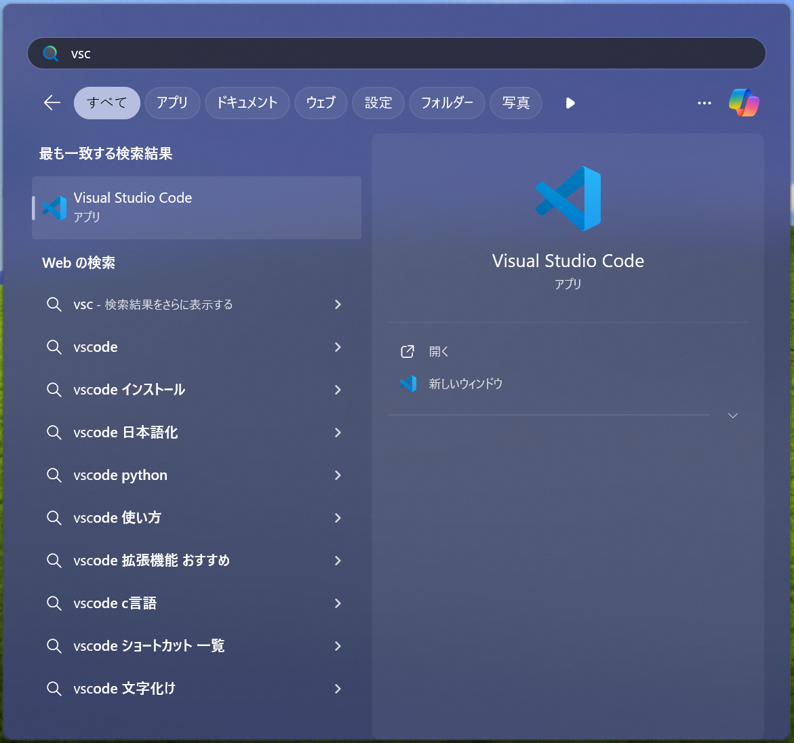
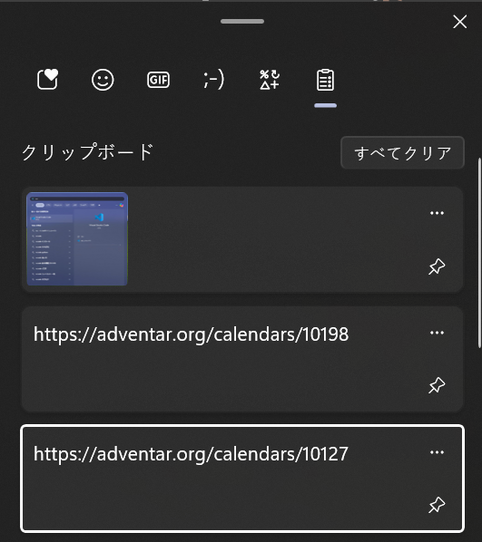
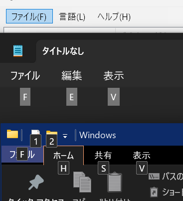
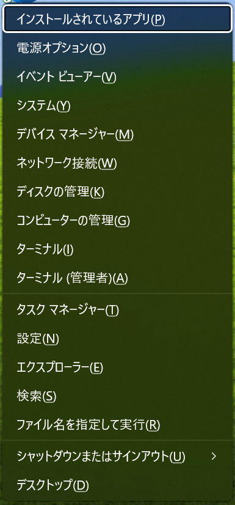
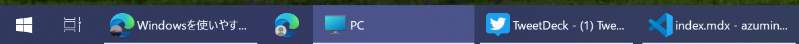
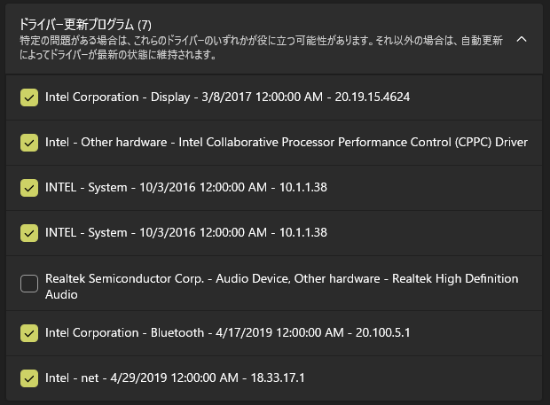
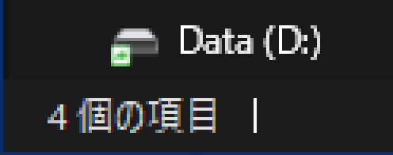

この記事はUEC Advent Calendar 2024の10日目の記事です。今年もその2が生えてるようです。

<OGPCard url="https://adventar.org/calendars/10127" />
<OGPCard url="https://adventar.org/calendars/10198" />

9日目の記事はこう(昼飯)さんの「」でした。

<OGPCard url="https://adventar.org/calendars/10127" />

今回は、Windowsを使ううえで便利だがあまり知られていない機能やソフトウェアを紹介します。いつものノリでどうでもいいことを書いてもよかったのですが、せっかくいつもよりは見てもらえそうなﾄﾞﾍﾞｶﾚということで実用寄りです。友人がPCを操作しているのを見てこれ使えば楽なのに!　と思ったものとか、自分がそれ早く教えてくれよ!　と思ったものとかが集められています。下に行くほどパワーユーザ向けです。PC初心者からWindowsエアプの逆張りLinuxユーザまでお楽しみいただけるかと思います。

## 左上でウィンドウを閉じる

たいていのアプリでは左上のアイコンをダブルクリックするとウィンドウを閉じることができる(EdgeとかWin11のエクスプローラとかアイコンがないやつは無理)。右上の閉じるボタンが遠いときとか地味に便利かも?　(特別PCに詳しいわけではない親がよく使っているのを見て覚えたけどどこで知ったんだろう……。)

## スタートメニューからの検索を使う

アプリを起動する際、デスクトップにショートカットを置いたりスタートメニューから探したりするのが一般的かもしれないが、検索機能を使うと素早いことがある。タスクバーの検索ボタン(標準設定だと主張が激しい)を使う、Win+Sのショートカットを使うほか、スタートメニューを開き、そのまま文字を打ち込むだけでも検索が始まる(のでタスクバーの検索ボタンは非表示でも困らない)。たとえば、VSCodeはWinキー→「v s c」→Enterでどんな場所からでも2秒で起動できる。Bingでの検索もできるので簡単な数式を入力すれば計算もできる。



ちなみに、パスが通っていないのに検索や「ファイル名を指定して実行」で開ける謎のアプリ(`7zfm`とか`vlc`とか)がたまにあるが、これはレジストリの`HKLM or HLCU\SOFTWARE\Microsoft\Windows\CurrentVersion\App Paths`に登録されているっぽい。

検索をランチャーにすると便利なのは他のOSでも同じことが多いので、いろいろと試してみるとよいかもしれない。

## ウィンドウスナップを使う

どこかの標準でまともにウィンドウ整理ができず、可能にするための野良アプリは有料という悲惨なOSとは違い、Windowsは標準でウィンドウスナップが使える。ウィンドウを左右にぶつけると2分割できるのはWin7のころからできるので知っている人も多いかもしれないが、Win10では角にぶつけると4分割、Win11では上にぶつけて左右に振ると3分割できる。

Win11では上部に持っていくといくつかレイアウトが表示されるが、ほとんどぶつける操作で代用できるうえ、ぶつけるのに比べ操作が煩雑なためあんまり使えない。最大化ボタンにカーソルを乗せることでも同じことができるが、待ち時間があるのでやはりぶつけたほうが早い。いずれも邪魔なら設定で無効にできる。

## マウスホイールで音量調整する (Windows 11)

Win11ではすべてが改悪されたと思いがちだが、わずかながら改善された点も存在する。タスクバーの音量アイコンにカーソルを合わせた状態でマウスホイールを回すと音量が調整できる。このとき、ポップアップで音量の数値も表示される。クリックして出るメニューでは数値は消し飛ばされているのに……。

## クリップボード履歴を使う

Win10以降には標準でクリップボード履歴機能が備わっている。これはクリップボードが最新のコピーだけでなく過去の複数のコピーを保持してくれる機能である。Win+Vを押して(有効でなければ)有効化ボタンを押すだけで使える。

自分は平成の人間なので積極的に使いこなせているかというと怪しいが、何回か前にコピーした内容を呼び起こすという使い方だけでも十分に便利である。逆に令和にもなって間違って何かをコピーしただけで前の内容が吹き飛ぶ某社のOSはどうかしている。



## PrintScreenキーでスクショする

𝕏ではよくWin+Shift+Sで範囲指定のスクリーンショットを撮れることが話題になっているが、もっと簡単な機能があることは言及されないことが多い。画面全体とかウィンドウ単位でのスクリーンショットを撮るのなら、ただ「PrintScreen」とか「PrtSc」とか書いてあるキーを押せばよい。単押しでは画面全体のスクリーンショットがクリップボードに保存される。「Alt」を押しながらならウィンドウのキャプチャになり、Winキーを押しながらならピクチャフォルダに画像ファイルとして保存される。Alt+Win+PrtScの組み合わせも効く(ビデオフォルダ行きになる)。

ただし、Win11でPrtSc単押しを画面全体スクリーンショットにしたい場合は「PrintScreenキーを使用して画面キャプチャを開く」の設定を無効にする必要がある。有効だとWin+Shift+Sと同じやつが開く。

ちなみに、TwitterやDiscordなどの入力欄ではクリップボードの画像をそのまま貼り付けて投稿できる。

## キーボードだけでUIを操作する

どこぞのキーボードだけで操作できなくもないけど画面にはショートカットが表示されずすべて覚える必要があるｦﾀｸっぽいOSとは違い、Windowsではキーを覚えなくてもだいたいマウスなしで操作できる。

まず、たいていのアプリでは、Tabキーと矢印キーを組み合わせることで画面上のほとんどの場所に移動できる。矢印で動かなかったらTabを押してみるとよい。ボタンなどの確定はスペースだったりEnterだったりする。Tabはほとんどの場合Shift+Tabで逆順になる。

上部にメニューバーのあるアプリでは、たとえば「ファイル(F)」などの表記がある場合は「Alt+F」など、Alt+カッコ内の文字でそのメニューを開ける(アクセスキー)。AltまたはF10を単押ししたのちに文字を入力してもアクセスできる。その先でも同様にショートカットキーが表示されるので、キーボードだけで操作できる。なくても矢印キーで選択できる。たいていはEscで上の階層に戻れる。一見案内のないエクスプローラやOfficeなどでも、Altキーを一度押すとボタンの近くにアクセスキーが表示される。



## ファイル名の頭文字でショートカットする

エクスプローラ等のリスト表示のUIで文字を打ち込むと、その文字で始まるファイル(あれば)まで一瞬で移動できる。繰り返し入力すれば次の該当するファイルに移動する。(異なる)複数文字を連続で打ち込めばその文字列で始まるファイルになる。レジストリエディタのツリーをたどるときとか便利。一応日本語も使える(左上に例の入力欄が出る)けどほぼ使わないかも。

## ロックして画面をオフにする

一定時間操作がないと画面が非表示になりモニタの電源が切れる設定があり、標準では有効になっているが、不意に非表示になってほしくなくて無効にしている人も多いかと思われる。しかし、電源を入れたまま外出したり就寝したりするなど、電源が切れてくれたほうが望ましい場面もある。そのたびに設定を変えたりモニタ側の電源を切ったりするのは面倒だが、実は簡単な方法がある。ロック画面でなら設定によらず画面が非表示になるので、ただロックすればよいのである。スタートメニューのほか、Win+Lキーでロックができる。

## Windows-Xメニューを使う

アプリのアンインストールとかデバイスマネージャとかディスクの管理とかターミナルとか、真っ当に開こうとすると少々面倒だが、タスクバーに固定しておくのもなんだかなぁという項目を非常に簡単に開く方法がある。Win8(.1だっけ?)以降では、WinキーとXキーを同時に押すか、スタートボタンを右クリックするとメニューが出る。自分はシャットダウンを「Win+X→U→U」で素早くでき、間違って再起動するなどの事故も防げるのが気に入っている。



ちなみに、このメニューの呼称は安定せず、[公式ページ](https://learn.microsoft.com/ja-jp/shows/inside/windows-x-menu)での「Windows-Xメニュー」のほか、Windows 10の設定内では「Win+Xメニュー」、MS製アプリのPowerToysのShortcut Guideでは「Quick Link menu」と呼ばれている。

## タスクバーラベルを表示する

Win7以降、タスクバーの表示はアイコンのみになり、同一アプリが複数起動していてもまとまるようになったが、Vista以前のようにラベルを表示することもできる。この記事を読んでいる方は~~Win11の開発者とは違い~~文字が読めると思うので、ラベルがあったほうが便利な可能性が高い。

ただし、Win11ではラベルの文字数に応じて幅がころころ変わるほか、インジケータの下線がアイコンの下にちょびっと表示されるだけのまま伸びなくなっており、非表示よりはマシなものの以前より使い勝手は低下している。~~Win11のデザイナ(笑)は文字どころか図形の大きさすら把握できないらしい。~~




## 英数キーをIME切替に使う

よく自称PCｦﾀｸはドヤ顔でCaps Lockを無効化しているが、使っているのがJISキーボードである場合、それは愚策である。そもそもJISキーボードにCaps Lockなどというキーはない。お手元のJISキーボードをご覧いただければ、Tabと左Shiftに挟まれているキーにはたしかに「Caps Lock」と書いてあるが、その下には「英数」と書いてあるはず。ためしに入力欄でそのキーを押すと、直接入力と日本語入力が切り替えられることが分かる。つまり、この「Shiftと同時押しするとCaps Lockになるキー」は、単押しではIME切替キーになるのである。左上の「半角/全角」キーに指を伸ばしたり、キーボードによってぜんぜん違う位置にある「変換」「無変換」キーを押したりしなくても、小指をちょっとずらすだけでIME切替はできたのである。知ったかぶりｦﾀｸの言葉を真に受けてこれを無効化するのはもったいない。

とはいえ、隣り合うShiftキーと英数キーを同時に押すとCaps Lockが発動するのは非常に邪魔くさい。そこで、PowerToys(wingetで入る)のKeyboard Managerを使って対処する。Caps Lockは「Shift + 英数」ではなく「Shift + Caps Lock」という扱いになる。「キーの再マップ」でCaps Lock単押し(キー入力はできないのでプルダウンから選ぶ)を無効化(Disableを割当)するとShift単押しに、リマップすると(単押しではなく)Shift+リマップしたキーになる。一方、「ショートカットの再マップ」で「Shift + Caps Lock」を無効化しても「Caps Lock」単押しは無効化されず発動してし、リマップすると単押しも発動しなくなる。したがって、無効化したい場合は「キーの再マップ」を、リマップしたい場合は「ショートカットの再マップ」を使うのがよい。自分は「無変換」を割り当て、IME設定で無変換キーをIMEオフにしている。

また、日本語入力の状態から英数キーを押したとき、Win11だとたまに直接入力(半角英数)ではなく全角英数となることがある(条件は謎)。気になる場合は英数キー(VK 240)を「半角/全角」キー(VK 244)にリマップしておくとよいだろう。

ちなみに、Apple製のJISキーボードには本物のCaps Lockキーが~~頭のおかしい位置に~~あるが、macOSにはCaps LockキーをIME切替として使う機能がある。標準機能でcontrolと位置を入れ替えればmacOSとWindowsで同じようにIME切替ができるようになる。また、Linuxでは英数キーが標準でCaps Lockにマッピングされていることが多いが、`xmodmap`で破壊し、Mozcだと英数キーの割り当てが(IME内の)直接入力でなんかきもいので「IMEオフ」に直してやれば同じように使えるようになる。

## FancyZonesでウィンドウ整理する

先ほど標準機能でのウィンドウスナップについて紹介したが、PowerToysに含まれているツールの一つ、FancyZonesを使うとより柔軟なウィンドウ整理ができる。マウスの副ボタンでゾーン表示するようにすると使いやすい。Win11純正機能もこれにすればよかったのに……。

## 複数モニタでカーソルがワープしないようにする

複数のDPIが異なるモニタを使っていると、ピクセル数と実際の大きさが異なっているため、カーソルが境界でワープしてしまうことがある。たとえば、対角線80cmの4Kモニタの横に対角線60cmのWUXGAモニタを縦置きすると、ピクセル数は縦2160pxと1920px、高さは39cmと51cmほどになり、大小関係が逆になる。

[LittleBigMouse](https://github.com/mgth/LittleBigMouse/releases)というアプリを使うと、表示処理上のピクセル数ではなく、現実での大きさに基づいてカーソルの移動が行われるようになる。大きさはモニタのメタデータから拾って正しい値になるが、前後にずれていたりすると遠近法で見た目の大きさが変わってくるので調整したほうが快適になる。モニタ間の余白を20mmくらいに設定しておくといい感じにひっかかってちょうどよくなる。しかし、標準のように角でだけひっかかってくれたりはしないのは残念。操作をフックするので不安定になるかと思ったが、驚くほど安定して動作している。なお、wingetでは古いバージョンがインストールされてしまうのでインストーラをダウンロードしてインストールする必要がある。

このくらい標準機能であってくれてもいいのにと思わんこともないが、ピクセル数基準での配置と現実基準での配置をどちらも指定しなければならなくなり(一方からもう一方を自動的に決定するなどはあまりいい結果にはならなさそう)、意外と難しいかもしれない。

## 管理者権限でアプリを起動する

アプリの起動時、Ctrl+Shiftを押していると管理者権限で起動できる。スタートメニュー、タスクバー、「ファイル名を指定して実行」、検索、エクスプローラからダブルクリックなどたいていの場所で使える。

## ワイヤレスイヤホンがスリープしないようにする

ワイヤレスイヤホンは音声出力がない場合にスリープされるが、音声が鳴ってから再起動するまでに遅延があり、音声の頭が途切れることがある。連続して鳴る音楽などを聞く分には困らないが、エラー音などの短いSEが丸々聞こえなくなったり、動画編集で再生停止を繰り返すときなんかは困る。何か音声を流してさえいれば止まらず、「無音」を再生することで防ぐことができる。一番手っ取り早い方法は[無音動画](https://www.youtube.com/watch?v=3Fy8XYr6J6s)を再生することだが、余計にブラウザウィンドウが一つ開くし、いちいちこれを開くのはめんどくさい。ffmpegで無音を生成しながら再生するなどの方法もある。

しかし、別件で仮想ループバック音源(音声出力先として機能し、出力された音を音声入力として別アプリで受け取れる)である[VB-Audio Virtual Cable](https://vb-audio.com/Cable/)を導入し、入力された音声を出力に混ぜる「このデバイスを聴く」を有効にしたところ、無音を再生するのと同じ効果が得られたので、これを使うことにした。イヤホンの出力をミュートにするか、VB-Cableを個別にミュートすれば、一時的にスリープさせることもできる。当然スリープしたほうが電池の消耗は抑えられるが、LinkBuds Sくんはつけっぱなしでもかなり電池が持つので気にしていない。

## Windows Updateでドライバを入れる

ドライバのインストールについてはWidows Updateを使うかメーカーからダウンロードしてインストールするかで派閥が分かれるかと思われるが、Windows Updateのドライバは勝手に入る場合とそうでない場合がある。勝手に入らないものは「オプションの更新プログラム」から追加のドライバを選択してインストールできる。また、[以前の記事](/blog/20240011-svp132-crean-install/)のように、追加のドライバがないとデフォで降ってくるドライバがエラーで入らないこともある。メーカー製PCの特殊なデバイスのドライバはWindows Updateから入手できないこともある(意外とできることもある)。ちなみに、自分はゲーム用のGPU以外はWindows Updateに任せている。



## コマンドでUEFIファームウェア設定を開く

通常、UEFIファームウェア設定を開くには、再起動して起動時に特定のキーを押すか、Shift+再起動などでWindows REを開き、そこから開く方法がある。前者は押すキーが分からなかったりタイミングがシビアだったりして面倒で、後者は時間がかかる。しかし、`shutdown /r /fw /t 0`を管理者権限で実行すれば、再起動したあと直にUEFIファームウェア設定が開く。

## 7-zipをファイラとして使う

全人類使っているであろう7-zipにはファイラ機能もある。スタートメニューや「ファイル名を指定して実行」から`7zfm`で起動できる。起動時にCtrl+Shiftを押下していると管理者権限で起動できるのは先述の通りだが、この状態だと管理者権限のコマンドラインからたどらないといけないような場所(EFIシステムパーティション等)もGUIで扱うことができる。さらに、マウントしていないファイルシステムを読取専用で開くこともできる。なんとNTFSやFAT32だけでなくext4とかでも覗ける。

## ローカルアカウントでもMicrosoftアカウントでログインする

Microsoftアカウントでセットアップするといろいろとめんどくさいことが多く、ある程度詳しい人はローカルアカウントでセットアップした後にMicrosoftアカウントでのログインに切り替えるという方法を取ることが多いと思われる。Microsoftアカウントでのログインは、Windowsのライセンスをアカウントに紐づけられたり、各種アプリでMicrosoftアカウントでのログインが容易になったりなどの恩恵がある。実は、アカウントの種類を変更するのではなく、設定→アカウント→メールとアカウントで「Microsoftアカウントを追加」すれば、ローカルアカウントのままでもこれらの機能を使うことができる。果たしてローカルアカウントのままにすることに利益があるのかどうかは謎だが……(パスワードをなしにできるくらい?)。

なお、電通大のMicrosoftアカウントはここからではログインできないが、「Microsoft 365 (Office)」アプリでサインインし、「すべてのアプリにサインインしたままにする」を「OK」、

## Officeを必要なものだけインストールする

普通にMicrosoft Officeをインストールすると、ExcelとかWordとか普通に使うやつ以外のよく分からないものもくっついてくる。詳細は面倒なので省くが、[Officeカスタマイズツール](https://learn.microsoft.com/ja-jp/microsoft-365-apps/admin-center/overview-office-customization-tool)で設定ファイルを作成し、[Office展開ツール](https://learn.microsoft.com/ja-jp/microsoft-365-apps/deploy/overview-office-deployment-tool)でそれを指定してインストールすることで必要なものだけをインストールすることができる。

## レジストリをいじらずに「システム無人スリープタイムアウト」を無効にする

Wake on LANなどでPCを起動すると通常設定できるほうではなく「システム無人スリープタイムアウト」の時間でスリープに移行してしまうことは知られているが、これを無効にする方法としてはレジストリをいじって項目を表示し、「電源プランの編集」から設定する方法がよく紹介されている。しかし、レジストリをいじらなくても以下のコマンドで表示できる。

```powershell
powercfg /attributes SUB_SLEEP UNATTENDSLEEP -ATTRIB_HIDE
```

また、設定を表示しなくても以下のコマンドで直接無効にできる。

```powershell
powercfg /setacvalueindex SCHEME_BALANCED SUB_SLEEP UNATTENDSLEEP 0
powercfg /setacvalueindex SCHEME_MAX SUB_SLEEP UNATTENDSLEEP 0
powercfg /setacvalueindex SCHEME_MIN SUB_SLEEP UNATTENDSLEEP 0
```

ちなみに、非表示になっている項目のエイリアス(UNATTENDSLEEPなど)はヘルプに載っていないコマンドの`powercfg /aliasesh`で表示できる。

## マウスホバーの時間を短くする

たまに特定の要素にカーソルを乗せたまま待つ、という操作があるが、レジストリで「待つ」時間を短くすることができる。`HKEY_CURRENT_USER\Control Panel\Desktop`の`MenuShowDelay`と`HKEY_CURRENT_USER\Control Panel\Mouse`の`MouseHoverTime`でミリ秒単位で設定できる。100ミリ秒とかにすると操作感が向上する。0にするのは使いにくくなるのでやめたほうがいい。

## Windows 11でAACではなくaptXが使われるようにする

Win11ではBluetooth A2DPのコーデックとして新たにAACが使えるようになったが、これはなぜかaptXよりも高い優先度になっている。つまり、AACとaptXの両方が使えるデバイスではAACが使われる。どちらがよいかは好みによるかもしれないが、aptXを使いたい場合はレジストリでAACを無効にすることでaptXが使われるようにすることができる。

```powershell
reg add "HKEY_LOCAL_MACHINE\SYSTEM\CurrentControlSet\Services\BthA2dp\Parameters" /v "BluetoothAacEnable" /t REG_DWORD /d 0
```

LE Audio、特に低遅延モードが手軽に使えるようになってほしいものである。Win11もAX200も対応してるはずなのだがどこかがダメらしい。最近導入したLinkBuds SくんはaptXに対応してないのでWindowsの微妙なAACを使わなければいけない……。

## Windows 11のUIをまともに戻す

Win11は文字を使わずアイコンですべてを表現しようとしたり、メニューを100階層くらいたどらないと目的の項目にたどり着けないようにしたり、余白を5000兆pxくらいとって1画面の情報量をゼロにしたりする酷いUIをしている。これでは使い物にならないので皆さんは[ExplorerPatcher](https://github.com/valinet/ExplorerPatcher)を使っていると思われるが、不安定にしたくないPCではこの手のものは入れたくないこともある。

実は、いくつかの修正はExplorerPatcherを使わずにレジストリでできる。ただ、昔はできたこともだんだん塞がれてきているので、今後のアップデートで破壊される可能性がある。24H2の時点で使えるものは以下。

### 右クリックメニューをまともにする

エクスプローラで右クリックしたとき、スッカスカで情報量ゼロのメニューではなく従来のメニューが出るようにする。

```powershell
reg add "HKEY_CURRENT_USER\Software\Classes\CLSID\{86ca1aa0-34aa-4e8b-a509-50c905bae2a2}\InProcServer32"
```

GUIで操作する場合は`InProcServer32`の「(既定)」を「(値の設定なし)」ではなく空文字列にすることに注意。

### エクスプローラのリボンを復活させる

エクスプローラ上部のUIを無限回クリックしないと目的の項目にたどりつかないカスのメニューからWin8-10のリボンUIに戻す。Win8もなかなか凄まじかったけど、デスクトップ部分に関してはちゃんと改良されていたということをWin11は思い出させてくれた。タブ機能は失われるので注意(作りが甘すぎてあまり役に立たないのでなくても困らないと思うが)。

```powershell
reg add "HKEY_CURRENT_USER\Software\Classes\CLSID\{6480100b-5a83-4d1e-9f69-8ae5a88e9a33}\InProcServer32"
```

こちらについては調べると「(既定)」の値を意味ありげな文字列にしたものが出てくるが、不要だった。また、`{2aa9162e-c906-4dd9-ad0b-3d24a8eef5a0}`のほうも必要としている例も多いが、ぱっと見あってもなくても見た目は変わらなかった(HKLMのほうの記述を見ると別のところが変わってそう)。

## サブピクセルレンダリングを無効化する

「Windowsのフォントは汚い」という雑な批判が出る理由のひとつにサブピクセルレンダリングがある。これは各画素にRGBの3色が並んでいることを利用して水平方向の解像度を疑似的に3倍にする技術であるが、色のにじみが生じてしまい、FHD以上が当たり前になった現代ではデメリットの方が目立つ。Win10以降では設定によらずグレースケールレンダリングが使われている場所が増えたが、いまだにサブピクセルレンダリングが使用されている場所もある。このサブピクセルレンダリングはレジストリで無効化できる。ただし、一部の場所ではサブピクセルレンダリングのままになったり、ごくまれにアンチエイリアスが完全に無効になってしまったりする。

```powershell
reg add "HKEY_CURRENT_USER\Control Panel\Desktop" /v "FontSmoothingType" /t REG_DWORD /d 1
```

一応GUIでも「ClearTypeテキストの調整」で「ClearTypeを有効にする」のチェックを外すことで無効化できる。すべてのフォントスムージングが無効化されるかのような表現だが、大半の場所ではグレースケールレンダリングが使われるようになる。その後に謎の調整をしなければいけないのでレジストリをしばいたほうが楽。



## あとがき

最後までお読みいただきありがとうございました。役に立つもの、知的好奇心を満たせるものがあれば幸いです。ちなみに今日12月10日は私の誕生日です[🥔](https://www.amazon.jp/hz/wishlist/ls/4E5GS0IUWN50?ref_=wl_share)。どうせ参加するならこの日にと思っていたのですが、去年は早々に埋まってしまったのとテーマが決まっていなかったのとで参加しそこねてしまいました。今年は記事を書くのも慣れてきたということでテーマを決める前に真っ先に枠を確保しました。

11日目の記事はえぐちさんの「なんか書く(なんかく)」です。一見ゴマキャンですが2単語からなる文であって合成語ではないのでゴママヨではありません。