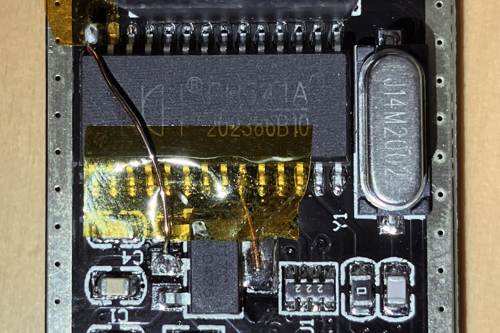
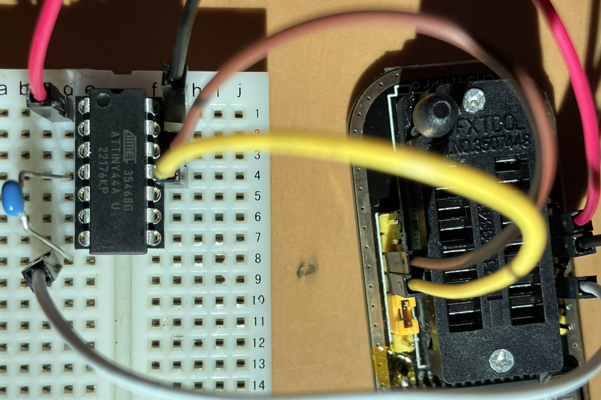
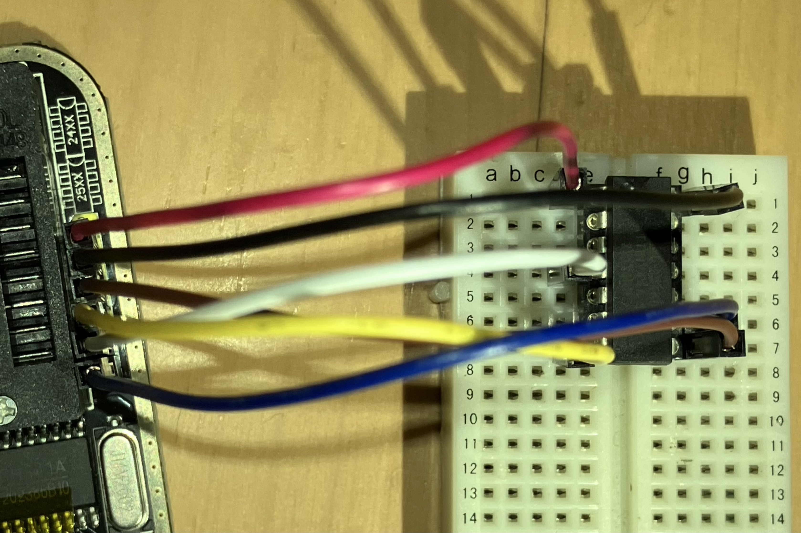

[前回](/blog/20250002-attiny-platformio/)紹介した通り、Optibootを書き込み「Arduino化」したAVRマイコンはUARTで書き込むことができる。UART接続にはArduino互換機に搭載されているWCHのUSBシリアル変換IC、CH340を用いた。ところで、マザーボードのBIOS等のROM(フラッシュメモリやEEPROM)を読み書きする(ROM焼き)ためによく使われるものとして、CH341Aと呼ばれるものがある。パソコンとUSB接続でき、ROMチップを接続するZIFソケットがついている基板で、特に「CH341A Mini Programmer」と書かれているもの(以下「ROM焼き器」と呼称)がよくアリエク等で出回っている。

## CH341Aとは

「CH341A」はこの基板の代名詞のように用いられるが、実際はUSBからROMとの通信に用いるSPI/I2Cへの変換を担う、CH340と同じ製造元のIC部分の名前である。

PDF直リンクではないため発見されにくいが、[公式サイト](https://www.wch-ic.com/downloads/CH341DS1_PDF.html)からデータシートを入手することができる。CH341シリーズは、CH340で使える非同期シリアル通信(UART)に加え、同期式シリアル通信(SPI, I2C)やパラレル通信(プリンタポート(標準パラレル?), EPP(拡張パラレル), MEM?)への変換機能が追加されていて、CH341Aでは全てに対応している。これらはモードを切り替えて使うことができ、CH340同様にUARTが仮想COMポートで扱える非同期シリアルモード(以下「UARTモード」)、プリントポートをUSBプリンタとして扱えるプリンタポートモード、パラレル通信と同期式シリアル通信を独自APIで扱えるモード(以下「独自APIモード」)がある。

CH341は、起動時にACT#ピンが2 kΩ抵抗を介してGNDに落とされていれば独自APIモードで起動し、浮いていればSDA, SCLピンの配線によってモードを切り替える。SDA, SCLピンを浮かせるとUARTモード、SDAをGNDに落とすと独自APIモード、SDAとSCLを接続するとプリンタポートモードになる。また、SDAとSCLを外部EEPROMに接続することでその他の設定を読み込むこともできるようである。BIOS ROMはSPIインタフェースのフラッシュメモリ(25なんちゃら)やI2CインタフェースのEEPROM(24なんちゃら)であることが多く、ROM焼き器として使う際は独自APIを介して同期式シリアル通信が使用される。

ROM焼き器は製造元すら不明であるため公式の情報を得ることは難しいが、[有志が作成した回路図](https://www.onetransistor.eu/2017/08/ch341a-mini-programmer-schematic.html)が存在する。これを見れば分かる通り、ROM焼き器ではACT#ピンをGNDに落とすか浮かせるかをジャンパピンで切り替えることができるようになっている。通常はACT#は「1-2」に刺さったジャンパピンでGNDに落とされていて、問答無用で独自APIモードで起動する。ジャンパを「2-3」に刺しかえるとモード切替ができるようになり、SDA, SCLを浮かせる(ソケットに何も接続しない)状態で起動すればUARTモードになる。使うことはほぼないと思われるが、SDAもSCLもソケットに出てきているため、両者を接続すればプリンタポートモードで、SDAをGNDに落とせば独自APIモードで起動することもできる。

## 電圧修正

多くのページで指摘されている通り、ROM焼き器には設計ミスが存在する。ソケットからROMに与える電源電圧はLDOを介した3.3 Vであるのに対し、CH341Aは5 Vで駆動されており、ロジック電圧が5 Vになってしまっている。ほとんどのICは電源電圧以上のロジック電圧を受け付けないため、このままでは書き込み対象を破壊する恐れがある。たとえば、ATtiny44ではピン電圧の絶対最大定格がVCC+0.5 Vであるため、3.3 V駆動時に5 Vの入力は認められない。

CH341AのVCCピンを基板から剥がし、このVCCピンとV3ピンを3.3 Vラインに接続することで、CH341Aを3.3 Vで駆動するよう修正することができる。これをするとピンヘッダから出るUARTの電圧も3.3 Vになるため、通信対象のICも3.3 Vで駆動するようにする。ICは5 V駆動でも3.3 Vで十分HIGHと認識することが多い(たとえばATtiny44のV_IHの最小は0.6 VCCで、5 V駆動でも3.0 V)が、こんどはICからCH341AのRXに入る電圧が5 Vになってしまい、これは絶対最大定格(VCC+0.5 V)を超えるため、CH341A側の破損リスクが生じる。



## ドライバインストール

ROM焼き器ではよく怪しいソフトウェアに同梱されたドライバをインストールするよう促されるが、実際には[WCH公式のドライバ](https://www.wch-ic.com/search?t=all&k=CH341)を使うことができる。ドライバは`CH341SER.EXE`と`CH341PAR.EXE`の2つがある。

`CH341SER.EXE`はCH340やUARTモードのCH341のドライバであり、仮想COMポートが作成される。これはわざわざダウンロードしなくてもWindows Updateから自動でインストールされる。一方、`CH341PAR.EXE`はCH341の独自APIモードのドライバで、Windows Updateからは降ってこない。また、アプリケーションによっては公式ドライバではなくWinUSBやlibusbドライバが必要なこともある。これらはUSB機器をほぼ直接触ることのできる汎用のドライバで、WCHが用意したライブラリを用いず、アプリケーションが比較的低レイヤな操作まで担当する場合に使うようである。[Zadig](https://zadig.akeo.ie/)を使うことで、簡単にこれらのドライバを適用することができる。なお、プリンタポートモードではWindows標準の`usbprint.sys`が使われる。

## UARTで書き込み (Optiboot)

ジャンパピンを「2-3」に差し替えてソケット(のSDA, SCL)に何も接続しない状態で起動するとUARTモードになり、CH340と同じように使うことができる。

UARTのピンはソケットにこそ出てきていないものの、ソケットの横のピンヘッダに出てきている。配置は裏面に印字されている。RX/TXはCH341AにとってのRX/TXなので、RXをATtinyのTXに、TXをRXに接続する。電源はこちら側には5 Vしか出ていないので、反対側のピンヘッダから3.3 Vを取る。GNDも忘れてはいけない。

自動リセットに使うDTRはピンヘッダには出ていないが、UARTモードでのDTRピンは、SPIモードでのMOSIピンと共通であり、反対側のピンヘッダのMOSIから引き出すことができる。これを0.1 μFのコンデンサを介してATtinyのRESETピン(プルアップは内蔵されている)に接続することで自動リセットが可能になる。



残りの手順は、タイミングを合わせるための小細工が不要なこと以外は前回と同じである。

## SPIで書き込み (ISP)

Optiboot自体の書き込みに用いられるISPも、フラッシュメモリ同様SPIによる通信で行われるため、CH341から直接行うことができる。SPIはCOMポートのように汎用的には扱えないためアプリケーション側での個別対応が必要であるが、幸い通常AVRマイコンの書き込みに使われる[AVRDUDE](https://github.com/avrdudes/avrdude/releases)はCH341Aにも対応している。PlatformIOに同梱されているものやwingetでインストールできるMSVCビルドではCH341Aに対応していないため、MSYS2 mingwビルドをダウンロードしてくる必要がある。また、CH341Aのドライバも公式ではなく汎用ドライバをZadigで適用する必要がある。WinUSB、libusb-win32、libusbKのいずれかを選択できるが、どれでも動作するようである。

SPIの各ピンもソケットだけでなくピンヘッダにも出てきてくれているため、UARTと同様にジャンパ線で接続できる。ピン配置はほぼArduino as ISPと同じであるが、ATtinyのRESETピンに接続するのがCH341AのCSピンである点のみ異なる。



接続できていることを確認するだけなら以下を実行する。

```powershell
.\avrdude.exe -v -p t44 -c ch341a
```

例として、前回焼いたのと同じ設定でPlatformIOに同梱されているOptibootを焼く場合は以下のように実行する。速度が速すぎるのか何度かやり直さないとVerifyが通らなかった。内蔵クロックの精度不足なのか電力不足なのか電源ノイズのせいなのか分からないが、ATtinyに与える電源を5 Vにしてみたら失敗しなくなったので、CH341A側の破損リスクを許容できるか、レベル変換ができるなら試してみてもよいかもしれない。

```powershell
.\avrdude.exe -v -p t44 -c ch341a -e -U efuse:w:0xFE:m -U hfuse:w:0xDF:m -U lfuse:w:0xE2:m -U flash:w:$env:USERPROFILE\.platformio\packages\framework-arduino-avr-attiny\bootloaders\optiboot\optiboot_attiny44_8000000L.hex:i
```

## ROM焼き

本来の使い方であるROM焼きについても触れておく。CH341AからROMを焼くためのソフトウェアはいくつも存在するが、[AsProgrammer](https://github.com/nofeletru/UsbAsp-flash)というものがオープンソースで素性が知れているため無難かもしれない。この手のものはWCH公式のドライバで動作する。ドライバが同梱されていることが多いが、公式からダウンロードできるのでわざわざ再配布のものを使う必要はないと思われる。

また、コマンドラインツールでLinuxではよく使われているflashromの[Windows版](https://github.com/therealdreg/flashrom_build_windows_x64)もCH341Aに対応している。ドライバはZadigから適用する必要がある。

NASの基板から剥ぎ取った(後[破壊された](https://twitter.com/yui__yuuki/status/1923330961246130456))SPIのROMはflashromで読み取りできることを[確認した](https://twitter.com/DG_7D/status/1923296863987331519)。しかし、手持ちの使っていないマザーボードのROMを剥がさずにクリップで接続したところ、マザボの3.3 Vラインを全てROM焼き器のLDOで駆動しようとしているような形になり、電力が足りずCH341Aが動作しなかった。同じ組み合わせで他のマザボでは動作することを~~使っていないマザボがたくさんある変なｵﾀｸに~~確認してもらったので、どこかが壊れているわけではなさそう。違う個体ではあるが同じ装備で一度は焼きなおしたことがあるマザボなので、何か条件を満たせば動作するのかもしれない。

## CH347T?

ちなみに、CH341Aの後継か上位互換かのような[CH347T](https://www.wch-ic.com/search?t=all&k=CH347)というICが存在する。パラレル通信に非対応な代わりにシリアル通信が強化されている、3.3 V駆動時も5 V入力を受け付けることのできるピンが存在する、SPIの速度が変更できるようになっている、正式にGPIOに対応している、など様々な進化を遂げている。これを搭載したROM焼き器も存在しており、同様に[回路図](https://www.onetransistor.eu/2024/09/ch347t-programmer-schematic.html)が作成されている。I2C ROMの読み書きに問題があるようだが、それ以外は問題なさそうである。また、モードは4つあるうちUART1つとSPIが同時に使えるMode 1に固定されているようだが、この状態でもUART部分は仮想COMポートとして使えそうである(データシートの記述は曖昧だが[このページ](https://oshwhub.com/leonmx/ch347-bian-cheng-qi)のスクショで見える)。CH341AのROM焼き器に劣る点もあり、DTRピンが設定ピンと共通で、この基板では固定されてしまっているため、Arduinoの自動リセットをすることはできない。また、flashromは対応しているが、AVRDUDEは対応していなさそうである。

## あとがき

ROM焼き専用に使われがちなCH341搭載ボードが一般的なシリアル変換器やISP書き込み器としても使える汎用性を持っていることを知ることができたのは、まあまあ大きな収穫である。特に、Arduino UNOを一台潰す必要があり取り回しの悪いArduino as ISPを使わなくても済むようになるのは便利である。

CH347T版は一般的なシリアル変換器やROM焼き器として使うには便利そうで気になるが、マイコンの書き込みという用途に限ってはCH341A版のほうが向いている。CH347T単品自体は[秋月電子](https://akizukidenshi.com/catalog/g/g117537/)で普通に売っているようなので、ROM焼き器として入手するよりは自分で都合のいい回路を作ったほうがいいかもしれない。