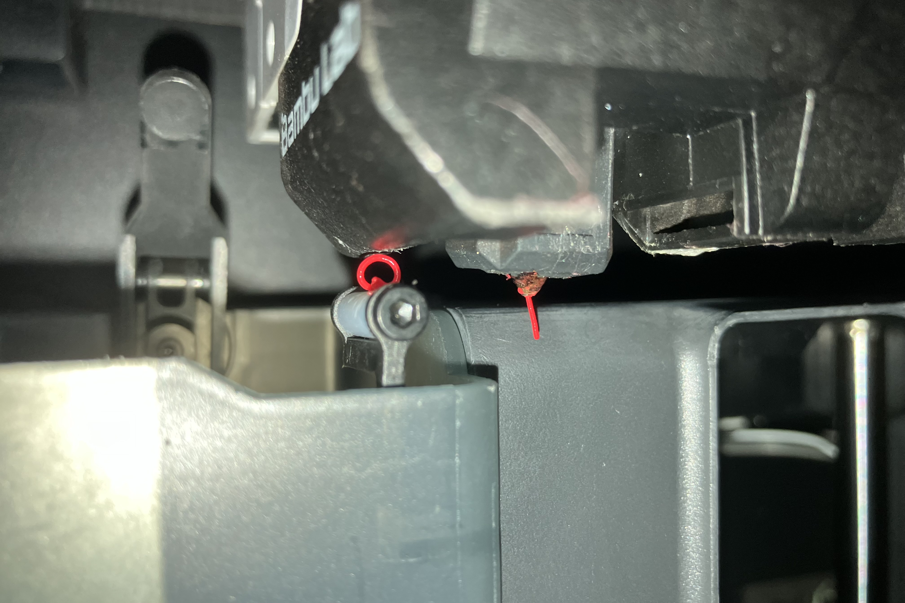
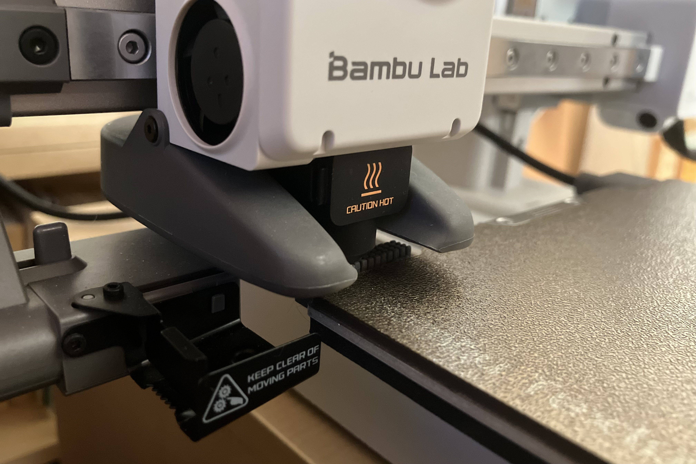
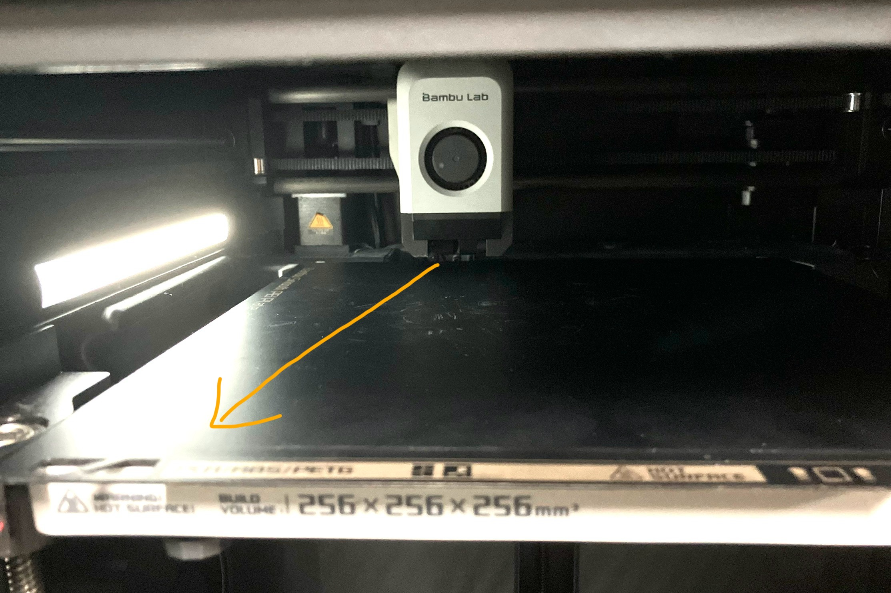
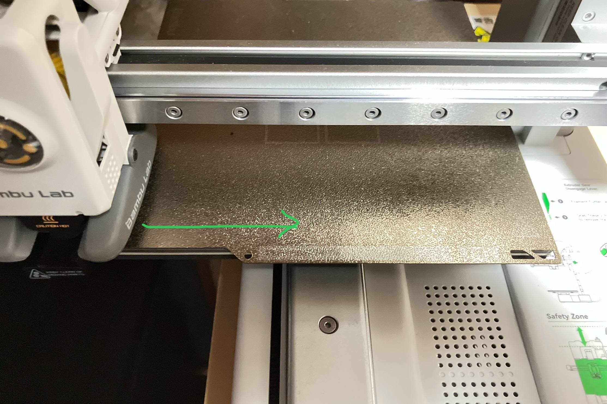
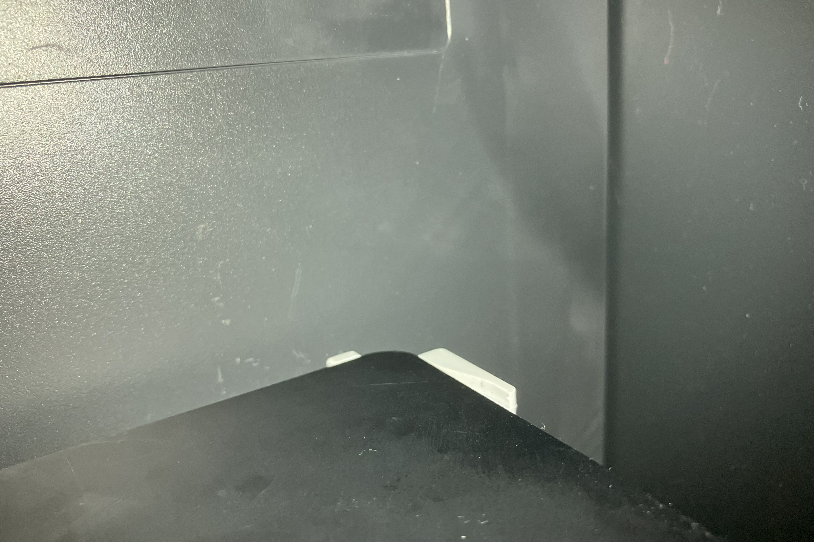
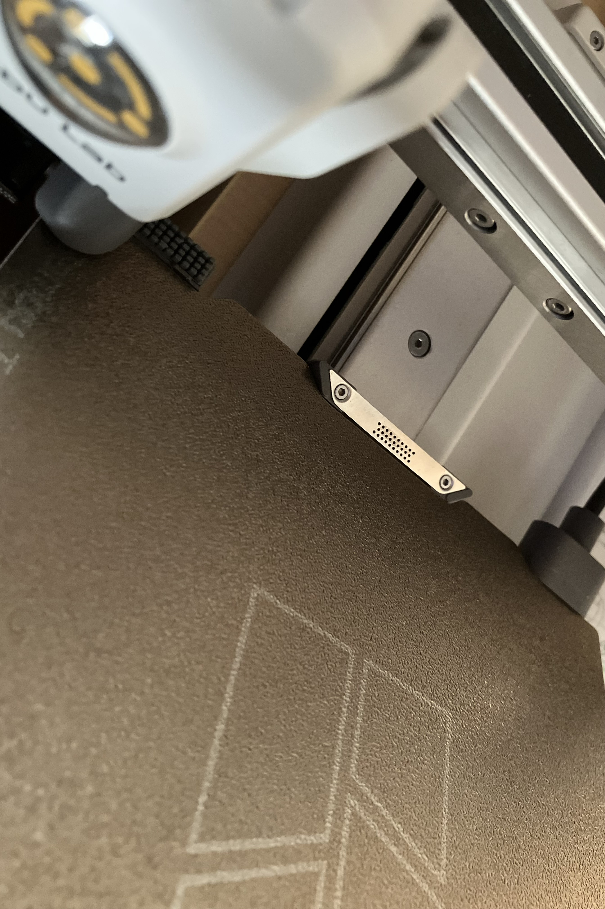

Bambu Lab製の3Dプリンタはその性能から高い人気を誇っている。P1Sは上位機種であるエンクロージャつきの機種のなかでは下位に位置し、最初期から主戦力となっていたが、つい最近後継機であるP2Sがようやく発売された。型落ちとなったP1Sはより安価に手に入るようになり、これまでの評判がよかったこともあって、購入を検討している人が多いと思われ、実際購入している人も多く見られる。しかし、P1Sが高性能とされたのは過去の栄光であり、後輩の下位機種と比べても苦しい部分が多々見受けられる。ここでは、自分が実際にP1Sと下位機種であるA1 miniを使った体験から、オンボロP1Sを間違って購入する悲劇から未来ある若者を救いたいと思う。なお、H2シリーズは興味がなく情報を集めたこともないため、ここでは比較を行わない。

## ベッドレベリング

3Dプリンタを使ううえで重要かつ面倒な手順として有名なものの一つがベッドレベリングである。Bambu Labの3Dプリンタはそんな手動でのベッドレベリングが不要であり、これが「一般人」への普及に一役買っているといえる。Ender-3の時代からすれば自動であるというだけで万々歳と思われるかもしれないが、現代では自動ベッドレベリングにも優劣というものが存在する。

一言で言ってしまえば、P1Sのベッドレベリングはありえないくらい遅い。10cmほどの間隔でノズルがベッドに触れていきベッドの高さを測定していくのだが、1点ごとに2秒ほどかかる。さらに、2列くらいの頻度でベッドを5秒間くらいきゅるきゅる振動させる謎の儀式が挟まる。さらに、毎回全ての点が測定されるため、造形物が小さかったとしても無駄に時間がかかる。Ender-3を手動で調整するのよりも長い時間がかかっているのではないかと思わされる。

一方、A1 miniのベッドレベリングは非常に高速である。1点あたり0.5秒程度で測定が行われるうえ、実際に造形する範囲だけが測定されるため、小さい造形物であれば数秒で終わってしまう。P1Sと同じ造形サイズのA1無印でもわずかに遅い程度で十分高速である。

P2Sについては未所持のため詳しいことは分からないが、少なくとも部分ベッドレベリングには対応しているようなので、P1Sよりは間違いなく高速である。

一応、P1Sにも数点のみ測定して前回と変化がなければレベリングを省略する機能があるのだが、実際にこれが発動して短時間で終わることは、体感で200回に1回程度しかない。

ベッドレベリングが長いと、造形失敗リスクと時間とを天秤にかける判断を毎回強いられ、非常にストレスが溜まる。毎回有効にしても時間がかからない現代的な機種を強く推奨する。

## フローダイナミクスキャリブレーション

FDM方式の3Dプリンタでは、フィラメントを押し出す量の精度は非常に重要である。溶けたフィラメントは流体であるため、エクストルーダの出力が変化してからノズルの先端から出てくる量が変化するまでの間には時間差が存在する。Bambuのプリンタにはこれをファームウェア側で補正する機能が搭載されているが、この特性はフィラメントの状態によって変化するため、適宜[校正を行う](https://wiki.bambulab.com/en/software/bambu-studio/calibration_pa)必要がある。

P1Sにはこれを自動校正する機能はなく、サンプルを刷って一番良いっぽいものを目視で選ぶという昔ながらの方法でしか校正ができない。フィラメントを変えるたびにこれを行う必要があるのは非常に面倒で、品質劣化の可能性と手間とを天秤にかける必要がある。

X1CではテストパターンとLiDARによる校正が可能であり、A1シリーズとP2Sではツールヘッドに内蔵された渦電流センサによる校正が可能である。ベッドレベンリング同様印刷の直前に行うことができ、フィラメントを変えたあとなどの最初の印刷時にオンにしておけばよいだけである。

なお、静的な流量(フローレート)はフローダイナミクスとは異なるものであり、これは純正フィラメントならあまり気にする必要がないとは言われているが、問題になれば[校正](https://wiki.bambulab.com/en/software/bambu-studio/calibration_flow_rate)する必要がある。これを自動校正できるのはX1シリーズのみである。P1SだろうがA1だろうがP2Sだろうが、一つ印刷するのに何分もかかるサンプルを何個も刷って目視で選ぶという苦行が求められる。次はここをなんとかしてほしいものだ。

## ノズルクリーニング

ノズルを過熱すると押し出していなくてもフィラメントが垂れてくるので、造形前の準備段階では適宜拭う必要がある。Bambuの3Dプリンタにはノズルワイパが設置されており、そこにノズルを移動させることで自動で掃除が行われる。

しかし、P1SのノズルワイパはPTFEチューブに引っ掛けるだけの非常にお粗末な構造をしている。取り切れなかったゴミは平気でベッドの上にぶちまけられ、当然のように造形物に絡まってくる。箱の下の部分にも大量のゴミが溜まり、それでいて出口には段差があって掃き出すこともできない。

A1シリーズではゴムでの拭き取りと金属での切り取りの二段構えのワイパが採用されており、しっかりと掃除される。また、ベッドスリンガ方式の特権として、ノズルがベッドの上を通過しなければならない距離が短いため、たとえ取り切れなくてもベッド上にゴミが落ちることはほとんどない。

P2Sではパージシュート自体の構造はそのままにワイパ部分が変更されているようであり、改善が期待される。また、出口の段差もなくなっている(ということは床にゴミが溜まるのは変わらないのか……)。CoreXY方式であるためツールヘッドのベッド上の移動距離が長いのは変わらず、A1シリーズよりはゴミが落ちやすいかもしれない。

## ホットエンド

3Dプリンタのホットエンドは掃除やノズル径の変更のために脱着が求められることがある。

P1Sのホットエンドは、冷却ファンとヒータおよびその配線などが一体になっている。さらに、これらはネジで固定されている。ノズルを交換したいだけであってもケーブルのちっさいコネクタを外して六角レンチをぐるぐる回して……という手順が求められる。

A1シリーズやP2Sではヒートシンクとノズルのみのホットエンド単体で脱着が可能である。固定は磁石とラッチのみで工具も不要で、片手で行える。

工研ではA1 miniが導入される前、P1S用の0.2mm, 0.8mmノズルを購入していたのだが、交換の面倒臭さから一度も使われたことはない。A1 mini導入後であれば簡単に交換できるそちらを買っていただろうに、勿体ない話である。

## ビルドプレートの固定

Bambuのプリンタのビルドプレートは磁石で固定されており、簡単に付け外しができる。取り付けの際には造形領域がはみ出さない程度に正しい位置に固定する必要がある。

このプレートの位置合わせにP1Sでは少し手間がかかる。一応ガイドのようなものがあるのだが、かなり浅い角度で入れないと機能せず、何も考えずに置こうとすると左右方向がズレて何度かやり直す羽目になる。あまり角度が浅すぎると今度は磁力でくっついてしまうのでまあまあシビアである。

A1 miniではある程度角度がついていても、奥に突き当てれば左右方向の位置もしっかり定まり、そのまま下ろすだけで定位置に固定できる。P1Sと同じプレートを使うA1無印やP2Sでも、A1 miniほど確実には固定できないと言う人もいるものの、それなりに改善されているように見える。

## 液晶画面

ここまでの悲劇に比べれるとまだ些細なことになってしまうが、液晶画面も低解像度でテキスト主体の残念なUIである。ボタンに対する反応も遅く、ちょっとヘッドを動かしたり温度をいじったりしようとするだけで苦しくなる。押し込みスイッチ1つのEnder-3のほうが格段に扱いやすいレベルである。

## あとがき

