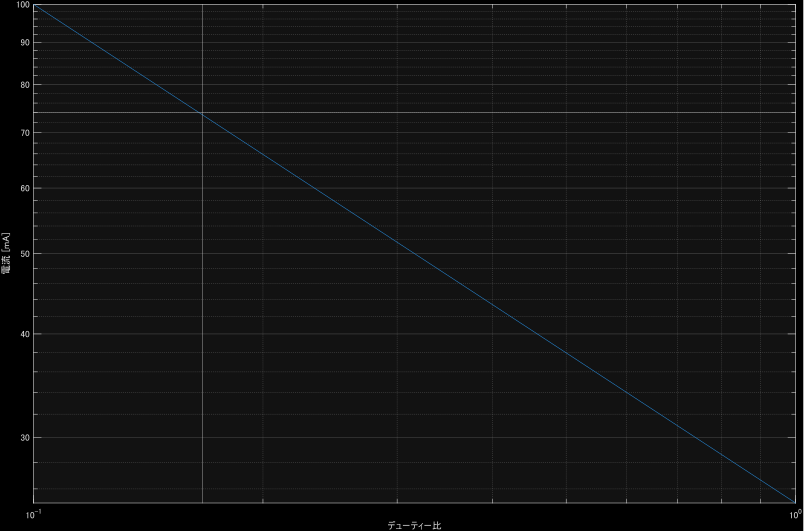

人間が生存可能な空間を生成するためにはエアコンが欠かせないわが国であるが、長時間出かけるときにもつけっぱなしというわけにはいかない(短時間であればつけっぱなしのほうが効率的なことはある)。しかし、帰宅してから電源を入れていては、部屋が人間の存在できる環境になるまでに時間がかかってしまう。帰宅時間がある程度予測できるのならタイマを設定しておけばよいが、大学生はいつ帰れるのか分からないがち。イマドキのエアコンであれば、インターネットに繋がっていて外出先からアプリで操作できるようなものもあるが、自室で使っているエアコンは最低限の機能のもので、そんな大層な機能はついていない。

そこで、遠隔操作でリモコンの赤外線信号を発することのできる装置を自作することにした。SwitchBotなど似たような既製品はないこともないが、この手の製品はNAT越えまで面倒を見てしまっていたりアプリから指示を出す前提だったりで、VPN経由でシンプルにWeb APIを叩くという使い方には向かないことが多い。また、材料は手持ちや工研に転がっているもので済むので作ったほうが安い。

## 設計指針

フロントエンドは常時起動PC(NASやWoLサーバに使用)で動作するWeb UIとする。PCとマイコンの間で通信し、マイコンから赤外線信号を発する。

PCとマイコンの間の通信は、LAN経由のHTTP APIとする。どうせ電源を取るのにUSBで繋ぐのでUARTで投げつけることも考えたが、Windowsでシリアルポートを扱うのは面倒なのでやめた。通信内容は送信したいビット列を送りつけるものとする。エアコンの設定を送りつけ、それに対応するビット列をマイコンの中に格納しておいて生成することも考えられるが、面倒なうえに柔軟性も欠くので却下。

マイコンはLAN接続ができる必要があるので、ESP32を使う。ESP32はWi-Fiが利用できるだけでなく、Remote Control Transceiver (RMT)という赤外線リモコン信号の送受信に特化したモジュールが搭載されているため、これを利用する。有線LANも頑張れば使えるらしいけど頑張らなきゃ使えない。

Web UIは使い慣れたBunで構成する。Webサーバ機能を内蔵しているため簡単なWebサービスを作るのには都合がよく、[WoLサーバ](https://github.com/DG-7D/SimpleWoLServer)で利用している。Bunでは容易にFFIができるため、簡単にシリアルポートを叩けるWin32 APIか何かがあれば嬉しかったが、残念ながらなさそうだった。

以前やったようにイヤホンジャックから音声として波形を直接出力すればマイコンが不要になるなども考えはしたが、後述するような搬送波を乗せるには周波数が足りるか怪しいことや、バックエンドから任意の音声を再生するのはブラウザと比べて面倒であることから、採用しなかった。

## 赤外線リモコンの形式

赤外線はそこらじゅうに溢れているので、単にHIGH/LOWをLEDのオン/オフに変換して世界に放っても信号として識別することはできない。赤外線リモコンでは、HIGHを点灯ではなく特定の周波数での点滅(矩形波)にし、受信側もその周波数でフィルタをかけることで、通信が成立している。振幅偏移変調(ASK)の一種のオンオフ変調(OOK)であり、振幅変調(AM)のデジタル版のようである。この特定の周波数で点滅する信号を搬送波と呼ぶ。搬送波の矩形波の周波数は38 kHzが使われることが多いらしい。また、デューティー比は1/3程度が一般的らしいが、状況によっては変えたほうが到達距離が伸びることもあるっぽい。

ここまではどの赤外線リモコンでも同じだが、開始、終了の目印となる信号や、データの0/1と信号のHIGH/LOWとの対応などはいくつかの形式が存在する。詳細は[先人の記事](https://elm-chan.org/docs/ir_format.html)を参照されたい。HIGHの部分が線ではなく塗り潰されているのは搬送波が乗っていることを表現していると思われ、実際、破壊しても困らない照明のリモコンを分解してLEDの足の電位をオシロスコープで観測したところ、そのように見えた。ついでにこのリモコンが送信しているデータの形式を調べたところ、典型的なNEC形式だった。

<Tweet id="1948367481480876341" />

## 送信器

ビット列を渡すことでそのまま送信できるようにするのは先述した通りであるが、照明のリモコンでは搬送波が33.5 kHzほどと標準的な値ではなかったため、搬送波の周波数やデューティ比も指定できるようにする。形式は今のところNEC形式決め打ちだが、その気になれば容易に他の形式にも対応できるようにする。

### RMT

ESP32のArduino環境ではRMT向けにも簡略化されたAPIが提供されているが、[以前](../20250008-platformio-pioarduino/)述べたようにv2系とv3系とで使い勝手が異なり、また、PlatformIOそのままでは古いv2系が使われてしまうため、v3系を使うには細工が必要になる。

v2, v3問わずArduino-ESP32の公式ドキュメントにはRMTに関する情報はほぼ無いが、スケッチ例はv2ではなんだか取っ付きにくいものしかない一方で、v3ではいくらか増えたり読みやすくなったりしている。どちらも[ソースコード](https://github.com/espressif/arduino-esp32/blob/master/cores/esp32/esp32-hal-rmt.h)上のコメントから情報を得られるほか、基本的な概念については[ESP-IDFのドキュメント](https://docs.espressif.com/projects/esp-idf/en/stable/esp32/api-reference/peripherals/rmt.html)が参考になる。

APIの使い心地は全体的にv3のほうが良い。チャンネルの識別に謎のオブジェクトではなくピン番号を使えるようになった。RMTの時間単位であるTickの設定において、1Tickの長さには制約があるが、v2では要求したTick長が使えない場合は実際のTick長は勝手に決められ、返り値で実際のTickが返されていたのに対し、v3では要求したTickが使えない場合は初期化に失敗する(falseが返る)ようになった。また、搬送波の設定において、v2ではHIGHのTick数とLOWのTick数をそれぞれ計算して指定する必要があったのに対し、v3では周波数とデューティ比を指定できるようになった。このように、明らかにv3のほうが使いやすくなっている。

RMTシンボルはHIGH/LOWの継続時間をTick数で保持する。これの配列を渡すことでその波形に予め指定した搬送波が載ったものがピンから出力される。同時にデータの長さも渡す必要があるが、いちいち`sizeof`するのはかっこ悪いし、そもそも配列はあらかじめ十分大きなものを定義していて面倒なので、文字列をパースする時に同時に数えておくようにし、配列と(中身のある)要素数の構造体として保持するようにした。

なお、搬送波について設定する`rmtSetCarrier`関数に罠があり、ソースコードのコメントには`carrier_level`が`true`で「polarity level」が「positive」、つまりHIGHで波が出ると書いてあるが、実装を見るとこれがそのまま`polarity_active_low`に渡されており、説明が逆になっている。通常の赤外線リモコンの信号を出す場合は`false`を渡す必要がある。

### Wi-Fi接続

IPアドレスを固定する運用はあまりしたくないためDHCPで取得するが、これに時間がかかることがよくある。運用を初めたら再起動をかけることはあまりないと思われるが、検証中はいちいち待ちたくない。そこで、取得したIPアドレスを再起動後も保持するようにし、まずはそのアドレスで接続を試みるようにした。また、DHCP取得が遅い時は再起動するとすぐに繋がることが多いため、一定時間内に接続できなかった場合は再起動をかけるようにした。IPアドレスを固定しないため、データの送信元から名前解決ができるよう、mDNSも設定しておいた。

### HTTPサーバ

WebサーバにはArduino-ESP32同梱の`WebServer.h`を使った。サードパーティのライブラリに`ESPAsyncWebServer.h`なるものもあり、こちらも試してみたが、今回のような単純な用途ではあまり違いがないように感じた。なお、PlatformIO標準の古いArduino-ESP32では`ESPAsyncWebServer.h`は古いものしか使えないようである。Arduino-ESP32の最新版を使おうと思ったきっかけがこれだった。

リクエストの形式は、POSTでボディに情報を乗せるのではなく、GETでURLのパラメータを使ってデータや搬送波の設定を受け取るようにした。パースが楽なのと、`curl`等で簡単にテストができるためである(POSTもできなくはないが)。データは今のところ`0`と`1`で時系列順にした文字列で受け取るようにしているが、16進数に対応したり、ビット順、バイト順の指定をできるようにしてもよいかもしれない。

### ハードウェア

赤外線LEDは工研に大量に転がっていたものを使ったが、型番が不明で仕様が分からなかったため、秋月で売っていて見た目の近い[OSIR5113A](https://akizukidenshi.com/catalog/g/g100656/)の数値を参考にすることにした。とりあえずGPIO直結で連続点灯の上限である25 mAが流れるように抵抗を噛ませて動作させたところ、照明のすぐ近くであれば反応したが、離れると機能しなかった。到達距離を伸ばすためには、数を増やしたり電流を増やしたりする必要がある。

ひとまず数を増やす。USBの5 V電源をそのまま使うことにすると、順方向電圧は1.25 Vのため、3本直列にすることができる。同じ本数ならできるだけ直列にしたほうが全体の電流も抵抗で捨てる電力も少なくて済む。これでは電圧も電流もGPIO直結では不足するため、MOSFET等でスイッチングする必要がある。ESP32のロジック電圧は3.3 Vのため、LEDを駆動するMOSFETも3.3 Vでオンになってもらう必要がある。[以前](../20240010-6pin-fan-pwm/)使った[都合のいいMOSFET](https://akizukidenshi.com/catalog/g/g115851/)は在庫が尽きてしまっていたため困っていたが、秋月で安売りされていたモータドライバ(と言いつつHブリッジとかではなくただのMOSFET)の[DRV777](https://akizukidenshi.com/catalog/g/g106463/)がちょうど使えた。モータドライバはこれに限らず3.3 Vで使えることが多いので、3.3 Vで動くスイッチング素子がほしい場合は、MOSFET単品ではなくモータドライバを探す手もあることを学んだ。

電流は既に上限なので増やせないと見せかけて、LEDはパルス駆動であれば連続点灯よりも大きな電流を流すことができる。この電流はパルス幅とデューティ比によって決まるようで、パルス幅は瞬間的な最大温度、デューティ比は平均的な発熱量に影響すると思われる。たとえば、1 ms光らせて9 ms消すのを10回くり返すのと、10 ms光らせて90 ms消すのとでは、平均的な発熱量は同じだが、後者のほうが最大温度が高くなる、ような気がする。まずはデューティ比によって放熱能力に応じた制限がかかり、さらに周波数が低い(パルス幅が長い)と1回のパルスでの温度上昇も問題になり耐熱に応じた制限がかかる、という印象である。

永遠に搬送波を出し続けるわけではないため、搬送波のデューティ比と周波数をもとに計算すると保守的になりすぎると思われる。まず、パルス幅について、最も点灯時間が長いかつ見かけ上のデューティ比が大きい、開始信号における点灯時間(1/3 × 16 × 562 μs ≃ 3 ms)を考慮する。実際には連続点灯ではないため、これより余裕がある。次に、デューティ比について、すべて1だった場合の値(1/3 × 1/2 = 1/6)を考慮することにする。実際には開始信号(1/3 × 2/3 = 2/9)もあるので若干大きくなるが、0(1/3 × 1/4 = 1/8)も混ざることを考えると多少大きくても問題ないと思われる。

この値での電流値をデータシートで確認してそれを流せばよい、といきたいところだが、データシートにはパルス幅10 ms、デューティ比1/10での値しか載っていない。パルス幅はともかく、デューティ比は1/10より大きいため、この電流値そのままでは大きすぎる可能性が高い。そこで、他のLEDのデータシートからパルス幅とデューティ比と電流の関係を調べてみることにする。

パルス幅と電流の関係がグラフで示されている製品では、デューティ比固定の線を引いているものと周波数固定の線を引いているものとがあった。[周波数固定の線を引いているもの](https://fscdn.rohm.com/jp/products/databook/datasheet/opto/optical_sensor/infrared_led/scm-013rtt86-j.pdf)では、パルス幅と電流の関係が両対数グラフで直線になっていた。デューティ比固定の線を引いているものは両対数グラフでないものが多く変な曲線になっていたが、[両対数グラフのもの](https://www.vishay.com/docs/81006/tsal4400.pdf)では、周波数が一定になる点を読み取っていくと直線になりそうな雰囲気だった。[横軸がデューティ比でパルス幅固定の線を引いているもの](https://akizukidenshi.com/goodsaffix/l12170.pdf)もあり、これは周波数を考慮していないようだが、同じく両対数グラフで直線になっていた。同じデューティ比でパルス幅や周波数を変えた場合の変化は、まったくないものも傾きが変わるものもあるが、パルス幅が短いほど電流が大きくなるようなので、パルス幅がデータシートの10 msより短い今回は無視しても余裕が増えるだけだと判断した。

周波数を固定すればパルス幅はデューティ比に比例するため、横軸をデューティ比、縦軸を電流とした両対数グラフで(1, 25 mA)と(1/10, 100 mA)の2点を結び、デューティ比1/6における電流を求めたところ、約74 mAとなった。電源電圧5 Vで、LEDをなるべく多く3本直列とすると順方向電圧は3.75 Vなので、電流制限抵抗は約18 Ωとなった。これは余裕をもった値であるため、少し小さめの15 Ωを使うことにした。使っているデータシート自体当てずっぽうなので多少雑でも今更である。

この電流と数であれば、部屋の端からでも照明を操作できるようになった。また、連続である程度送信してもLEDが燃えたり性能が低下したりはしていないようだった。なお、電源として使うUSB 2.0の電流は500 mAまでなので、やろうと思えば3直列を6並列の18本までLEDをつけられる。

## リモコン解析

エアコンのリモコンがどのような形式で通信しているのかを調べる必要がある。エアコンのリモコンは壊したくないため、赤外線として送信された信号を受信して解読する。[オタク](https://twitter.com/yui__yuuki)が腐らせていた赤外線受信器[OSRB38C9AA](https://akizukidenshi.com/catalog/g/g104659/)(Active Lowなので注意)を借り、出力をオシロスコープで観測してみたところ、開始、終了の信号と、0/1とHIGH/LOWの対応はNEC形式と同じであり、データ長のみ拡張されて23バイトになっていることが分かった。

<Tweet id="1950550478145921270" hideThread />

データの中身を読み取る必要があるが、この長さではオシロの画面から目視で読み取るというのは難しい。Arduinoを用いて受信器の信号を0/1のビット列に[変換できるようにした](https://github.com/DG-7D/IRDecoderNEC)。色々な方式に対応しようとすると面倒になるが、NEC形式と決め打ちすればかなり簡単にできる。終了信号がただのパルスなおかげで立ち下がりエッジの間隔を見るだけで済む。これでは終了を検出することはできないが、適当な時間経ったら終了するようにしておいた。RMTは受信にも対応しているようだが、単純に済ませられるならこちらの方が楽である。

データの長さから、押したボタンだけを送信しているわけではなく、リモコン側が状態を保持していて毎度全て送信している方式であることが予想される。受信した信号のビット列と設定されていた状態をまとめるExcelシートを作成し、設定を網羅するように操作してデータを集めた。ビット列をバイトごとに区切り、設定と対応するバイトを探し出し、当該行を別のシートにコピーして、「重複の削除」を行うことでビット列と設定との対応を得ることができた。

途中ランダムに見える部分があったが、どうやら時刻を保持しているらしいことが分かった。リモコンには時刻設定の機能はなく、単に電池を入れてからの分数などかとも思ったが、しっかり時と分に分かれていて謎である。「待つ」以外に変化させる手段がないためサンプル数が限られるが、50台が上限っぽいので「分」だろうと当てをつけることができた。さらに、タイマの情報も「時間」ではなく「時刻」で送信されていた。

また、最終バイトのチェックサムと思われるものについて、変化したバイトと最終バイトの変わり方の対応から、各バイトのビットごとのXORだろうと予測したが、なぜか合わずに一定のずれ方をした。結果から言えば、先頭2バイトは無関係で、3バイト目以降のXORを取ると一致した。もとのNEC形式では先頭2バイトはカスタマコードなので、データ部のみのXORと考えれば説明はつく。

ひとまずテスト用にすべてのパラメータを直打ちしてビット列を生成、送信できる[WebUI](https://github.com/DG-7D/HAS22CRemote)を作成した。同じリポジトリに解析結果のまとめも置いてある。Windows環境だとmDNSの解決が遅いことがあるため、環境変数[`BUN_CONFIG_DNS_TIME_TO_LIVE_SECONDS`](https://bun.com/docs/runtime/networking/dns#configuring-dns-cache-ttl)を24時間ほどに設定したうえで、最初に`Bun.dns.prefetch()`でキャッシュを生成しておくことで、毎日使う分には解決待ちを発生させないようにしている。

## あとがき

自分で作ればアプリとかサ終とか気にせず好きなように使えるので、もしIoT対応エアコンだったとしても自作する価値はある。対応エアコンと異なる点として、エアコンから情報を受け取ることはできず、正常に稼動しているかどうかも分からないため、温度センサなどもつけておくと嬉しいかもしれない。