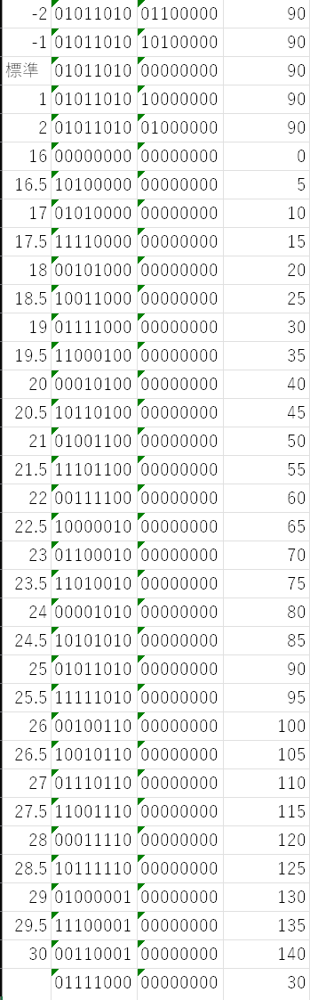

人間が生存可能な空間を生成するためにはエアコンが欠かせないわが国であるが、長時間出かけるときにもつけっぱなしというわけにはいかない(短時間であればつけっぱなしのほうが効率的なことはある)。しかし、帰宅してから電源を入れていては、部屋が人間の存在できる環境になるまでに時間がかかってしまう。帰宅時間がある程度予測できるのならタイマを設定しておけばよいが、大学生はいつ帰れるのか分からないがち。イマドキのエアコンであれば、インターネットに繋がっていて外出先からアプリで操作できるようなものもあるが、自室で使っているエアコンは最低限の機能のもので、そんな大層な機能はついていない。

そこで、遠隔操作でリモコンの赤外線信号を発することのできる装置を自作することにした。似たような既製品はないこともないが、材料は工研に転がっているので安く済むし、自作したほうが自由度が高い。

## 

操作はHTTP APIで任意のビット列を送信することで行えるようにする。サーバ用のPCからUARTで投げつけることも考えたが、Windowsでシリアルポートを扱うのは面倒なのでやめた。また、ビット列をマイコンの中に格納するのは面倒なうえに柔軟性も欠くので却下。

LAN接続ができる必要があるので、ESP32を使う。

ESP32はWi-Fiが利用できるだけでなく、Remote Control Transceiver (RMT)という赤外線リモコン信号の送受信に特化したモジュールが搭載されている。

## 赤外線リモコンの形式

赤外線はそこらじゅうに溢れているので、単にHIGH/LOWをLEDのオン/オフに変換しても信号として識別することはできない。赤外線リモコンでは、HIGHを点灯ではなく特定の周波数での点滅にし、受信側もその周波数でフィルタをかけることで、通信が成立している。振幅偏移変調(ASK)の一種のオンオフ変調(OOK)であり、振幅変調(AM)のデジタル版のようである。この特定の周波数で点滅する信号を搬送波と呼ぶ。

ここまではどの赤外線リモコンでも同じだが、開始、終了の目印となる信号や、データの0/1と信号のHIGH/LOWとの対応などはいくつかの形式が存在する。詳細は[先人の記事](https://elm-chan.org/docs/ir_format.html)を参照されたい。搬送波のパルスじみた波形(矩形波)ともとの信号としてのパルスがあって混乱するが、波形を遠くから見るとHIGHの部分は塗り潰されているように見えると考えればよい。実際、破壊しても困らないリモコンを分解してLEDの足の電位をオシロスコープで観測したところ、そのように見えた。

<Tweet id="1948367481480876341" />

## リモコン解析

エアコンのリモコンがどのような形式で通信しているのかを調べる必要がある。[オタク](https://twitter.com/yui__yuuki)が腐らせていた赤外線受信器[OSRB38C9AA](https://akizukidenshi.com/catalog/g/g104659/)(Active Lowなので注意)を借り、出力をオシロスコープで観測してみたところ、開始、終了の信号と、0/1とHIGH/LOWの対応はNEC形式と同じであり、データ長のみ拡張されていることが分かった。

<Tweet id="1950550478145921270" />

さらにデータの形式を調べるため、Arduinoを用いて受信器の信号を0/1のビット列に変換できるようにした。色々な方式に対応しようとすると面倒になるが、NEC形式と決め打ちすればかなり簡単にできる。終了信号がただのパルスなおかげで立ち上がりエッジの間隔を見るだけで済む。

データの長さから、押したボタンだけを送信しているわけではなく、リモコン側が状態を保持していて毎度全て送信している方式であることが予想される。受信した信号のビット列と設定されていた状態をまとめるExcelシートを作成し、設定を網羅するように操作してデータを集めた。ビット列をバイトごとに区切り、設定と対応するバイトを探し出し、当該行を別のシートにコピーして、「重複の削除」を行うことでビット列と設定との対応を得ることができた。

途中ランダムに見える部分があったが、どうやら時刻を保持しているらしいことが分かった。リモコンには時刻設定の機能はなく、単に電池を入れてからの分数などかとも思ったが、しっかり時と分に分かれていて謎である。「待つ」以外に変化させる手段がないためサンプル数が限られるが、50台が上限っぽいので「分」だろうと当てをつけることができた。さらに、タイマの情報も「時間」ではなく「時刻」で送信されていた。

また、最終バイトのチェックサムと思われるものについて、変化したバイトと最終バイトの変わり方の対応から、各バイトのビットごとのXORだろうと予測したが、なぜか合わずに一定のずれ方をした。結果から言えば、先頭2バイトは無関係で、3バイト目以降のXORを取ると一致した。もとのNEC形式では先頭2バイトはカスタマコードなので、データ部のみのXORと考えれば説明はつく。

テスト用にすべてのパラメータを直打ちしてビット列を生成できる[WebUI](https://github.com/DG-7D/HAS22CRemote)を作成した。同じリポジトリに解析結果のまとめも置いてある。

## 送信器

### RMT

送信するデータが用意できたので、これを赤外線信号にする送信器を実装する。ESP32のArduino環境ではRMT向けにも簡略化されたAPIが提供されているが、[以前](../20250008-platformio-pioarduino/)述べたようにv2系とv3系とで使い勝手が異なり、また、PlatformIOそのままでは古いv2系が使われてしまうため、v3系を使うには細工が必要になる。

v2, v3問わずArduino-ESP32の公式ドキュメントにはRMTに関する情報はほぼ無いが、スケッチ例はv2ではなんだか取っ付きにくいものしかない一方で、v3ではいくらか増えたり読みやすくなったりしている。どちらも[ソースコード](https://github.com/espressif/arduino-esp32/blob/master/cores/esp32/esp32-hal-rmt.h)上のコメントから情報を得られるほか、基本的な概念については[ESP-IDFのドキュメント](https://docs.espressif.com/projects/esp-idf/en/stable/esp32/api-reference/peripherals/rmt.html)が参考になる。

APIの使い心地は全体的にv3のほうが良い。チャンネルの識別に謎のオブジェクトではなくピン番号を使えるようになった。RMTの時間単位であるTickの設定において、1Tickの長さには制約があるが、v2では要求したTick長が使えない場合は実際のTick長は勝手に決められ、返り値で実際のTickが返されていたのに対し、v3では要求したTickが使えない場合は初期化に失敗する(falseが返る)ようになった。また、搬送波の設定において、v2ではHIGHのTick数とLOWのTick数をそれぞれ計算して指定する必要があったのに対し、v3では周波数とデューティ比を指定できるようになった。このように、明らかにv3のほうが使いやすくなっている。

RMTシンボルはHIGH/LOWの継続時間をTick数で保持する。これの配列を渡すことでその波形に予め指定した搬送波が載ったものがピンから出力される。同時にデータの長さも渡す必要があるが、いちいち`sizeof`するのはかっこ悪いし、そもそも配列はあらかじめ十分大きなものを定義していて面倒なので、文字列をパースする時に同時に数えておくようにし、配列と(中身のある)要素数の構造体として保持するようにした。

なお、搬送波について設定する`rmtSetCarrier`関数に罠があり、ソースコードのコメントには`carrier_level`が`true`で「polarity level」が「positive」、つまりHIGHで波が出ると書いてあるが、実装を見るとこれがそのまま`polarity_active_low`に渡されており、説明が逆になっている。通常の赤外線リモコンの信号を出す場合は`false`を渡す必要がある。

### Wi-Fi接続

IPアドレスを固定する運用はあまりしたくないためDHCPで取得するが、これに時間がかかることがよくある。運用を初めたら再起動をかけることはあまりないと思われるが、検証中はいちいち待ちたくない。そこで、取得したIPアドレスを再起動後も保持するようにし、まずはそのアドレスで接続を試みるようにした。また、DHCP取得が遅い時は再起動するとすぐに繋がることが多いため、一定時間内に接続できなかった場合は再起動をかけるようにした。IPアドレスを固定しないため、データの送信元から名前解決ができるよう、mDNSも設定しておいた。

### HTTPサーバ

https://note.com/ndenki/n/n35bb7a41bbd8